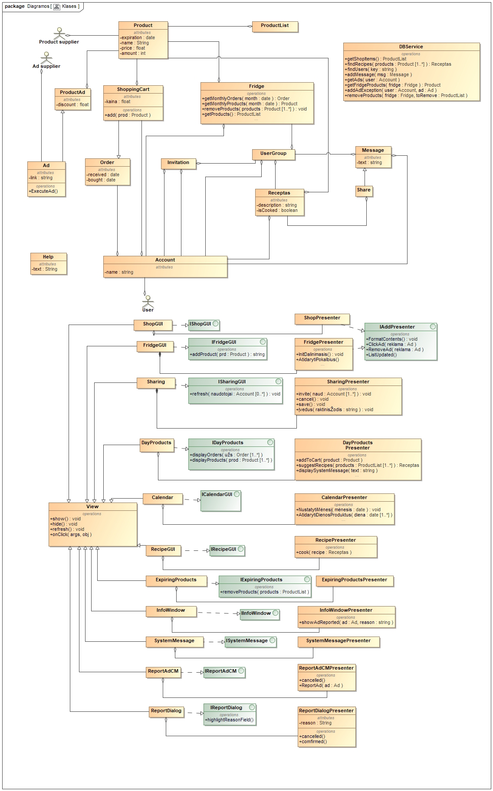

# Turinys
 
1. [Sistemos užduotys](#1-užduotys)
	1. [Papildyta užduočių diagrama](#11-užduočių-diagrama)
	2. [Pranešimo dėl produktų galiojimo pabaigos peržiūrėjimas](#12-pranešimo-dėl-produktų-galiojimo-pabaigos-peržiūrėjimas)
	3. [Produkto užsakymas per parduotuvę](#13-produkto-užsakymas-per-parduotuvę)
	4. [Šaldytuvo dalinimasis](#14-šaldytuvo-dalinimasis)
	5. [Naudotojas bendrauja su kitais grupės nariais per pranešimus](#15-naudotojas-bendrauja-su-kitais-grupės-nariais-per-pranešimus)
	6. [Naudotojas atsiverčia kalendorių produktams peržiūrėti](#16-naudotojas-atsiverčia-kalendorių-produktams-peržiūrėti)
	7. [Reklamų rodymas](#17-reklamų-rodymas)
2. [Sistemos struktūra](#2-sistemos-struktūra) 
	1. [Esybių sąrašas](#21-esybių-sąrašas)
	2. [Pradinė klasių diagrama](#22-klasių-diagrama)
	3. [Klasių ir reikalavimų matrica](#23-klasių-ir-reikalavimų-matrica)
3. [Detalaus projektavimo peržiūra](#3-detalaus-projektavimo-peržiūra)
	1. [Pranešimas dėl senstančių produktų](#31-pranešimas-dėl-senstančių-produktų)
	2. [Dalinimasis šaldytuvu](#32-dalinimasis-šaldytuvu)
	3. [Bendravimas pranešimais](#33-bendravimas-pranešimais)
	4. [Kalendoriaus naudojimas](#34-kalendoriaus-naudojimas)
	5. [Reklamų peržiūra](#35-reklamų-peržiūra)
	6. [Pakeisti projektiniai sprendimai](#36-pakeisti-projektiniai-sprendimai)
	7. [Pokyčiai statinei struktūrai](#37-pokyčiai-statinei-struktūrai)
4. [Testavimo planas ir scenarijai](#4-testavimo-planas-ir-scenarijai)
	1. [Programinių vienetų testai](#41-programinių-vienetų-testai)
	2. [Sistemos užduočių testai](#42-sistemos-užduočių-testai)
5. [Sistemos techninė architektūra](#5-sistemos-techninė-architektūra)
	1. [Sistemos komponentai](#51-sistemos-komponentai)
	2. [Fizinis pjūvis](#52-fizinis-pjūvis)
6. [Sistemos realizacija](#6-sistemos-realizacija)
	1. [Duomenų bazės schema](#61-duomenų-bazės-schema)
	2. [Pradiniai programų kodai](#62-pradiniai-programų-kodai)


<!-- pagebreak -->
# 1. Užduotys

## 1.1 Užduočių diagrama


Figūroje 1.1 yra pavaizduota detalesnė užduočių diagrama. Joje yra ne tik aprašyti užduočių scenarijai, bet ir pastebėti kiti, logiškai vykdomi prieš ar po aprašytų scenarijų. Numatyta, kad naudotojas gali dalintis receptais ir bendrauti pranešimais tik prisijungęs prie naudotojų grupės. Naudotojas dalindamasis šaldytuvu sukuria naują grupę, nebent dalinasi su grupe, kurios yra narys. Kad naudotojas užsakytų produktą, turi jį įdėti į krepšelį. Tik užsakius krepšelį produktas bus laikomas užsakytu. Reklamų tiekėjas užsakydamas reklamą patalpina ją į sistemą.

Naudotojas peržiūrėdamas senstančius produktus pranešimuose ar kalendoriuje gali ieškoti tokių receptų, kuriais išvengtų sugedusio maisto. Jei naudotojas nenori gaminti ar neįmanoma sudaryti tokių receptų, jam leidžiama šalinti senstančius produktus iš sistemos. Naudotojas pažymi, kad gamina receptą, sistema pateikia gamybos informaciją ir kitokią pagalbą. Gaminimo pabaigoje sistema automatiškai pašalina sunaudotus produktus.

<!-- pagebreak -->
### 1.2. Pranešimo dėl produktų galiojimo pabaigos peržiūrėjimas

#### Užduoties vykdymą inicijuojantis trigeris
~~Sistemoje yra produktų, kurių galiojimo terminas artėja prie nustatytos ribos.~~
Sistemoje aptinkamas vienas ar daugiau produktų kurių galiojimo data skiriasi nuo esamos datos per vartotojo nustatytą dienų skaičių. (Toliau: senstantis produktas)

#### Užduoties vykdymo prieš-sąlygos
Sistemos nustatymai yra tokie, kurie leistų sistemai siųsti pranešimus.

#### Pagrindinis scenarijus
Naudotojas yra informuojamas pranešimų piktogramos pranešimų juostoje spalvos pasikeitimu, kad esama senstančių produktų. Naudotojas paspaudžia ant pranešimų piktogramos. Sistema atidaro langą "Senstantys produktai". Naujame lange nurodyti produktai, kurie tuoj pasens, taip pat ir receptai iš šių produktų, jei tokių galima sudaryti. Naudotojas pasirenka vieną iš pasiūlytų receptų ir spaudžia mygtuką "Gaminti". Norėdamas dalį senstančių produktų pašalinti naudotojas juos pažymi ir spaudžia pašalinti. Sistema pašalina produktus iš šaldytuvo ir atnaujina vaizduojamą informaciją.

#### Alternatyvūs scenarijai
Nėra jokių receptų, kuriuos būtų galima pagaminti iš šaldytuve esančių produktų naudojant senstančius produktus. Vietoje pasiūlyto recepto sistema parodo, jog iš esamų produktų nepavyksta sudaryti recepto. Norėdamas visus ar dalį senstančių produktų pašalinti naudotojas juos pažymi ir spaudžia pašalinti. Sistema pašalina produktus iš šaldytuvo ir atnaujina vaizduojamą informaciją.  

<!-- pagebreak -->
#### Robustiškumo diagrama


Robustiškumo diagramoje 1.2.1 pavaizduotos kokios veiklos vyksta sistemoje, kai vartotojas sąveikauja su grafine sąsaja, kurioje rodomi senstantys produktai.

#### Detalizuota sekų diagrama


<!-- pagebreak -->
### 1.3. Produkto užsakymas per parduotuvę

#### Pagrindinis scenarijus
Naudotojas lange "Parduotuvė"  paspaudžia mygtuką "Įtraukti į krepšelį", kuris yra prie produkto pavadinimo. Sistema, į tai reaguodama, įtraukia produktą į krepšelio produktų sąrašą. Naudotojas, sudėjęs norimus produktus į krepšelį, norėdamas užbaigti užsakymą, spaudžia "Mano krepšelis". Sistema atidaro atitinkamai pavadintą langą. Naudotojas spaudžia "Užsakyti". Sistema suformuluoja ir išsiunčia užsakymo užklausą produktų tiekėjui.

#### Alternatyvūs scenarijai
Jei naudotojas nebenori dalies Krepšelio turinio, jis pažymi lange "Krepšelis" žymimuosius langelius šalia nenorimų produktų pavadinimų ir paspaudžia mygtuką "Pašalinti iš krepšelio". Sistema pašalina pažymėtus elementus iš krepšelio produktų sąrašo.

<!-- pagebreak -->
#### Robustiškumo diagrama


Robustiškumo diagramoje 1.3.1 pavaizduotos kokios veiklos vyksta sistemoje, kai vartotojas sąveikauja su parduotuvės ir/ar krepšelio grafinėmis sąsajomis.

<!-- pagebreak -->
### 1.4. Šaldytuvo dalinimasis

#### Pagrindinis scenarijus
Naudotojas, norėdamas dalintis šaldytuvu, lange "Šaldytuvas" spaudžia mygtuką "Dalintis". Sistema parodo langą "Dalinimasis" su jame esančia naudotojų informacija. Naudotojas pažymi žymimuosius langelius prie naudotojų vardų, su kuriais nori dalintis šaldytuvu, ir paspaudžia mygtuką "Patvirtinti". Sistema išsiunčia kvietimą kitiems naudotojams ir praneša kvietėjui kad pasirinkti naudotojai buvo pakviesti.

#### Alternatyvūs scenarijai
Naudotojas lange "Dalinimasis" paspaudžia mygtuką "Atšaukti". Sistema pašalina visus tame lange buvusius pasirinkimus. Sistema tada sugrąžina naudotoją į langą "Šaldytuvas".

<!-- pagebreak -->
#### Robustiškumo diagrama


Robustiškumo diagramoje 1.4.1 pavaizduotos kokios veiklos vyksta sistemoje, kai vartotojas sąveikauja su šaldytuvo dalinimosi grafine sąsaja, bei veiklos, nusakančios kaip vartotojas į šią sąsają patenka iš šaldytuvo lango.

#### Detalizuota sekų diagrama


<!-- pagebreak -->
### 1.5. Naudotojas bendrauja su kitais grupės nariais per pranešimus

#### Pagrindinis scenarijus
Naudotojas pokalbių lange paspaudžia "Rašyti pranešimą". Sistema susiranda naudotojų grupę, kurią tuo metu yra pasirinkęs vartotojas, ir pavaizduoja sąraše visus narius kaip galimus gavėjus. Naudotojas pasirenka, kam nori siųsti pranešimą. Sistema aktyvuoja susirašinėjimui skirtą plotą. Naudotojas šiame plote parašo pranešimo tekstą ir paspaudžia mygtuką "Siųsti". Pranešimas išsiunčiamas pasirinktiems gavėjams.  

#### Alternatyvus scenarijus
Jei naudotojas nori pasidalinti receptu, jis, pasirinkęs su kuo susirašinėti, paspaudžia mygtuką "Dalintis receptais". Atsidariusiame receptų lange naudotojas pažymi receptus, kuriais nori dalintis, tada spaudžia mygtuką "Patvirtinti". Pasirinkti receptai pridedami prie pranešimo.

Dėl kokių nors priežasčių pranešimo nepavyko nusiųsti. Sistema informuoją naudotoją apie tai ir nurodo to priežastį. Naudotojui leidžiama pabandyti siųsti iš naujo. Naudotojas, po kelių nesėkmingų bandymų, paspaudžia "atšaukti". Sistema uždaro sisteminį pranešimą ir grįžtama į pokalbių langą.

<!-- pagebreak -->
#### Robustiškumo diagrama


Robustiškumo diagramoje 1.5.1 pavaizduotos kokios veiklos vyksta sistemoje, kai vartotojas sąveikauja su pokalbių langu, o vėliau galimai receptų dalinimosi langu bei pradinis atsiradimo pokalbių lange procesas.

#### Detalizuota sekų diagrama


<!-- pagebreak -->
### 1.6. Naudotojas atsiverčia kalendorių produktams peržiūrėti

#### Pagrindinis scenarijus
Kalendoriaus lange naudotojui automatiškai pavaizduojamas esamas mėnesis. Sistema automatiškai pavaizduoja kiekvieną užsakymą ties diena, kada buvo užsakyta. Naudotojas spaudžia ant pliuso prie dienos. Sistema suranda dienos užsakymų informaciją ir atvaizduoja ją lange "Dienos produktai". Peržiūrėdamas produktus naudotojas pasirenka vieną ir spaudžia „Užsakyti daugiau“. Sistema suranda produktą ir įdeda jį į naudotojo krepšelį. Naudotojas spaudžia "Grįžti". Sistema grąžina naudotoją į kalendoriaus langą.  

#### Alternatyvūs scenarijai  
Naudotojas pasirenka kurių nors metų kokį nors mėnesį. Sistema atvaizduoja to mėnesio informaciją pagal pasirinktą rėžimą.  
Naudotojas yra paspaudęs „žiūrėti pagal galiojimo laiką“.  Sistema atvaizduoja mėnesyje produktų galiojimo pabaigas. Naudotojas pasirenka dieną ir spaudžia „+“. Sistema atvaizduoja produktus lange „Dienos produktai“. 
Norėdamas išvengti pasenusio maisto naudotojas spaudžia „siūlyti receptus“.  Sistema ieško receptų, su produktais, kurie pasirinktą dieną baigs galioti. Sistema nuveda naudotoją į receptų langą ir pavaizduoja rastus receptus. Naudotojas išsirenka receptą ir spaudžia "gaminti". Pradedamas gaminimo scenarijus gaminimo pagalbiniame lange. Naudotojas baigęs gaminti receptą uždaro receptų langą.
Nepavyko rasti receptų pagal dienos produktus. Naudotojas lieka dienos produktų lange, parodomas sisteminis pranešimas, kad nepavyko rasti.

<!-- pagebreak -->
#### Robustiškumo diagrama


Figūroje 1.6.1 pavaizduotoje robustiškumo diagramoje pavaizduotas pagrindinis užduoties scenarijus ir alternatyvieji per objektus. Naudotojas sąveikauja pirma su kalendoriaus langu, tada su dienos produktų, o šiame lange pasirinkęs gauti receptus - su receptų langu.

#### Detalizuota sekų diagrama


<!-- pagebreak -->
### 1.7. Reklamų rodymas  

#### Pagrindinis scenarijus  
Naudotojui naršant "Mano produktai" arba "Visi produktai" meniu sistema kartais įterpia reklamą tarp rodomų produktų. Reklama yra tokio paties dydžio kaip ir produktų paveikslėliai, tačiau skiriasi kraštinės spalva. Naudotojas paspaudžia ant reklamos. Sistema nukreipia naudotoją į reklamos nuorodą. 

#### Alternatyvūs scenarijai
Jei reklama yra nuolaida produktui šioje sistemoje, tai sistema reaguodama į paspaudimą duoda pasirinkimą nurodytą produktą įtraukti į krepšelį su atitinkama kaina. Naudotojas paspaudžia sutikti. Sistema įtraukia produktą į krepšelį.

Naudotojas nenorėdamas matyti reklamos, spaudžia jos kampe esantį "x" mygtuką. Sistema paslepia reklamą ir vietoje jos vaizduoja produktą.

Naudotojui paspaudus dešinį pelės mygtuką (arba ilgai palietus, jei naudojamasi mobiliąją versija) sistema parodo pasirinkimą pranešti apie netinkamą reklamos turinį. Naudotojas spaudžia "pranešti". Sistema atidaro dialogą, kuriame prašoma nurodyti priežastį, kodėl ta reklama yra netinkama. Naudotojas suveda informaciją ir spaudžia "patvirtina". Sistema neberodo jam šios reklamos ir persiunčia pranešimą dėl netinkamo turinio sistemos administratoriams, kurie nuspręs, ar dėl tos reklamos reikia imtis tolimesnių veiksmų.

<!-- pagebreak -->
#### Robustiškumo diagrama


Robustiškumo diagramoje 1.7.1 pavaizduotos kokios veiklų sekos vyksta sistemoje, kai vartotojas teigiamai arba neigiamai sąveikauja su reklama.

#### Detalizuota sekų diagrama


<!-- pagebreak -->
# 2. Sistemos struktūra

## 2.1 Esybių sąrašas
 * Produktas
 * Pranešimas
 * Grupė
 * Užsakymas
 * Tiekėjas
 * Naudotojas
 * Šaldytuvas
 * Receptas

## 2.2 Klasių diagrama



Dalykinės srites struktūrą galima pamatyti 2.2. diagramoje. Svarbiausia klasė yra naudotojo paskyra. Ją sukuria naudotojas prisiregistruodamas. Naudotojai sudaro grupes, kuriose dalinasi receptais per pranešimus. Produktai yra teikiami produktų tiekėjo, reklamos - reklamų tiekėjo. Kiekvienas naudotojas turi savo šaldytuvą ir gali juo dalintis su naudotojų grupe.

## 2.3 Klasių ir reikalavimų matrica


Klasių ir reikalavimų matricoje (figūra 2.3) nurodomi sąryšiai tarp užsakovo reikalavimų ir dalykinės srities klasių. Matosi, kad svarbiausia klasė yra naudotojo paskyra. Visi reikalavimai yra įgyvendinami bent viena klase ir kiekviena klasė įgyvendina bent vieną reikalavimą.

<!-- pagebreak -->
# 3 Detalaus projektavimo peržiūra

## Pakeitimai:
Kiekviename punkte surašote pataisymus, tiek teksto, tiek sekų diagramos, tiek robustiškumo diagramos. Robustiškumo diagramas taisyti tik tada, kai žymiai keičiasi UC tekstas.

## 3.1 Pranešimas dėl senstančių produktų
- Sekų diagrama pakeista taip, kad joje matytųsi, kad presenteriai sukuria langų, su kuriais vartotojas dirba, instancijas ir juos pavaizduoja.
- .


## 3.2 Dalinimasis šaldytuvu
- Iš užduoties scenarijaus pašalintas pranešimo gavimas, kai pakvietas vartotojas priima kvietimą, ir tai perkelta į "Kvietimo Priėmimo" užduoties scenarijų
- Sekų diagramoje pakeista, kad pakvietus vartotoją prezenteris kreipiasi į view kviesdamas dialogą su pranšimu apie sėkmingą pakvietimą, papildytas užduoties tekstas
- Sekų diagrama išversta į anglų kalbą
- Robustiškumo diagrama pakeista, kad atitiktų naują užduoties scenarijaus tekstą


## 3.3 Bendravimas pranešimais
- Pastebėta, kad UC prasidėdavo per anksti, taip pat šiek tiek supaprastinta formuluotė. Atnaujinta UC, bei RD ir sekų diagramos, kad atitikti atjaujintą UC
- Atnaujintas antras UC alternatyvus scenarijus. Su užsakovu aptarus nuspresta, kad žinutės saugojimo įgyvendinimo kaštų/naudos santykis pernelyg didelis. Atitinkamai atnaujinta RD ir sekų diagramos
- Sekų diagrama išversta į anglų kalbą


## 3.4 Kalendoriaus naudojimas
- Išverstas sekų diagramos tekstas: metodų pavadinimai, argumentai ir objektų pavadinimai
- Pridėtas metodas klasėje DBService - "removeProducts(Fridge fridge, ProductList products)"
- Ištrintas produktų šalinimas po gaminimo užduoties atlikimo, nes tai yra ne Kalendoriaus užduoties scenarijaus dalis, o gaminimo
- Sekų diagramoje įvestyje iš naudotojo patikslinti spaudžiamų mygtukų pavadinimai, kad sutaptų su scenarijaus tekstu
- Pataisytos kelios metodų kvietimu eiliškumo klaidos (pvz., 21. Presenteris ieško receptų -> 22. naudotojas spaudžia "siūlyti receptus"), atsiradusios dėl diagramos redagavimo
- Pridėti trūkstami argumentai displayOrders, displayProducts ir kituose metoduose
- Pridėtas alternatyvus scenarijus, kai nerandama receptų, turinčių ingridientų iš senstančių produktų ("dienos produktai" lange). Papildyta sekų ir robustiškumo diagramos

## 3.5 Reklamų peržiūra
- Pakeista robustiškumo diagrama: nupigintos prekės pridėjimas į krepšelį perduotas kitam užduoties scenarijui; patikslinta, kad nukreipiant į 3 šalies reklamos turinį dalyvauja kitas aktorius; patikslinta, kad sis. administratoriai ir reklamos tiekėjai mato pranešimus apie netinkamą reklamą informaciniame lange.
- .

## 3.6 Pakeisti projektiniai sprendimai
- Nuspresta iš MVC architektūros pereiti prie MVP, nes MVP labiau priimtina komandai, nes turime daugiau patirties, ir dažniau taikoma praktikoje
- Nuspresta programuoti anglų kalba, nes ši kalba labiau unifikuota
- Nuspresta vietoje daug "Event Handler" naudoti tik vieną "Event Handler" kiekvienam GUI elementui, kuris kviečia sistemos logiką ("Sanity check" rezultatas, dalyvavo programuotojai)
-

## 3.7 Pokyčiai statinei struktūrai
- ICalendarGUI papildytas dviem metodais: displayOrders(Order[]) ir displayProducts(ProductList).
- DayProductsPresenter papildytas metodu openRecipesWindow(Recipe[]), kuris atidaro receptų langą su nurodytais receptais.
- Sudėti trūkstami grąžinami tipai prie klasių operacijų.
<!-- pagebreak -->
# 4. Testavimo planas ir scenarijai

## 4.1 Testavimo planas

**Tikslas**

Rasti su funkciniais reikalavimais susijusius defektus kaip įmanoma anksčiau ir kokybiškai bei
laiku ištaisyti.

**Testavimo būdai ir prielaidos**

Testuojant sistemą bus atliekamas funkcinis testavimas, remiantis parašytais testavimo scenarijais,
kuris atitiks ir „acceptance“ testavimą. Taip pat šiuo testavimu bus patikrintas bendras sistemos
darbas.

**Laukiami testų rezultatai**

Testo rezultatas vertinamas tokiais apibūdinimais:
- Sėkmingas. Testavimo scenarijus išpildytas idealiai arba su minimaliais komentarais.
- Dalinai sėkmingas. Testavimo scenarijus išpildytas su komentarais apie būtinus pataisymus.
- Nesėkmingas. Testavimo scenarijaus didžioji dalis neišpildyta.

**Defektų valdymo priemonės ir metodai**

Visi randami defektai yra fiksuojami ir aprašomi. Tada jie yra registruojami į defektų registravimo
sistemą. Užregistravus defektą, pranešimas su defekto aprašu yra automatiškai išsiunčiamas
atsakingiems žmonėms. Reikalavimas, kurio testavimas nėra įmanomas, yra pažymimas kaip
kritinė klaida ir jo testavimas yra nukeliamas, kol tai yra įmanoma padaryti.

**Defektų klasifikavimo strategija**

Defektai klasifikuojami pagal jų įtaką projekto produktui:
- Aukštas - stipriai daro įtaką funkcinėms produkto savybėms, dėl kurių funkcionalumas nėra
išpildomas.
- Vidutinis - vidutiniškai daro įtaką funkcinėms produkto savybėms, dėl kurių
funkcionalumas yra išpildomas tik dalinai.
- Žemas – nedideli netikslumai.

**Defekto uždarymo strategija**

Defektas uždaromas tik tokiu atveju jeigu defektą registravęs asmuo patikrina ar jis išspręstas.

**Sėkmingo arba nesėkmingo testavimo kriterijai**

Testavimo scenarijaus gautas rezultatas yra laikomas sėkmingu, jei jis yra įvykdytas be klaidų
arba su keliomis žemo lygio klaidomis.

Etapo testavimas yra laikomas sėkmingu, jei testavimo metu nėra rasta aukšto lygio klaidų ir
testuojamas funkcionalumas padengia didžiąją dalį (>70%) suplanuoto testuoti skirto
funkcionalumo. Apie neištestuotą funkcionalumą turi būti informuoti atsakingi žmonės. Projekto
testavimas yra sėkmingas, jei buvo neaptiktos aukšto lygio klaidos. Vidutinio lygio klaidų ne
daugiau kaip 10% ir žemo lygio klaidų ne daugiau kaip 60%.

## 4.2 Programinių vienetų testai

### 4.2.1 Šaldytuvo Dalinimosi užduoties vienetų testai

Šioje testų klasėje testuojamas naudotojų atradimo metodas bei vartotojų pakvietimo metodas. Taip pat testuojami DBService metodai(FindUser() ir GetProduktai()) susiję su šiomis užduotimis.

Testuojamos klasės: 
>FridgePresenter
>
>SharingPresenter
>
>DBService

``` cs
[TestClass]
public class FridgePresenterTests
{
	[TestMethod]
	public void OnInput_UserFound_Return0()
	{
		FridgePresenter FP = new FridgePresenter(new Fridge() {nameField = "admin"});
		FP.DB = new DBService();
		int result = SV.OnInput();
		Assert.AreEqual(result, 0);
	}

	[TestMethod]
	public void OnInput_UserNotFound_Return1()
	{
		FridgePresenter FP = new FridgePresenter(new Fridge() {nameField = "******"});
		FP.DB = new DBService();
		int result = SV.OnInput();
		Assert.AreEqual(result, 1);
	}
}
```

``` cs
[TestClass]
public class SharingPresenterTests
{
	[TestMethod]
	public void Invite_UserInvited_Return0()
	{
		IDBService DB = new DBService();
		SharingPresenter SP = new SharingPresenter(new Sharing())
		SP.Users.Add(new User() {name = "admin"});
		int result = SP.Invite();
		SP.ShowDialog("admin");
		Assert.AreNotEqual(result.Count, 0);
	}
	
	[TestMethod]
	public void Invite_UserNotInvited_Return1()
	{
		IDBService DB = new DBService();
		SharingPresenter SP = new SharingPresenter(new Sharing())
		SP.Users.Add(new User() {name = "admin"});
		int result = SP.Invite();
		SP.ShowDialog("admin");
		Assert.AreNotEqual(result.Count, 1);
	}
}
```

``` cs
[TestClass]
public class DBServiceTests
{
	[TestMethod]
	public void FindUser_UserFound_ReturnNot0()
	{
		IDBService DB = new DBService();
		int result = DB.FindUser("admin").count;
		Assert.AreNotEqual(result, 0);
	}

	[TestMethod]
	public void FindUser_UserNotFound_Return0()
	{
		IDBService DB = new DBService();
		int result = DB.FindUser(" *******").count; //Invalid characters ' ' and '*'
		Assert.AreEqual(result, 0);
	}
	
	[TestMethod]
	public void GetProduktai_ProduktaiFound_Return0()
	{
		IDBService DB = new DBService();
		int result = DB.GetProduktai(); //Connection successful, got products
		Assert.AreEqual(result, 0);
	}
}
```

### 4.2.3 "Kalendoriaus naudojimo produktų peržiūrai" užduoties vienetų testai

Testuojamos klasės: 
>Fridge
>
>CalendarPresenter
>
>DBService
>
>DayProductsPresenter
>
>ShoppingCart

```cs
	[TestClass]
    public class DBServiceTest
    {
        DBService DB;
		List<Product> products;
        [TestInitialize]
        public void setUp()
        {
            DB = new DBService();
            DB.knownRecipes = new List<Recipe>();
			products = new List<Product>();
            products.Add(new Product("apple"));
            products.Add( new Product("milk"));
            DB.knownRecipes.Add(new Recipe("Boiled eggs"));
        }
        [TestMethod]
        public void FindRecipesTest()
        {
            DB.knownRecipes.Add(new Recipe("Apple pie"));
            int results = DB.findRecipes(products).Count;
            Assert.AreEqual(results, 1, "Only one recipe should have been found.");
        }

        [TestMethod]
        public void NoRecipesFoundTest()
        {
            DB.knownRecipes.Add(new Recipe("French fries"));
            int results = DB.findRecipes(products).Count;
            Assert.AreEqual(results, 0, "No recipes should have been found.");
        }
    }
```
Šioje testų klasėje testuojamas DBService metodas "findRecipes", kuris suranda naudotojui žinomus receptus, kurių sudėtyje yra produktų iš duoto sąrašo. Testiniais metodais patikrinamas pagrindinis (rasta receptų) ir alternatyvus scenarijus (nerasta).

```cs
	[TestClass]
    class CalendarPresenterTests
    {
        [TestMethod]
        public void setMonthTest()
        {
            Calendar view = new Calendar();
            CalendarPresenter presenter = new CalendarPresenter(view);
            view.month = "2019/05";
            presenter.setMonth("2019/06");
            Assert.AreEqual("2019/06", view.month, "Month should be set to 2019/06");
        }

    }
```

Šioje klasėje yra testuojamas CalendarPresenter metodas "setMonth", kuriuo yra nustatomas mėnesis, kurio informacija rodoma grafinėje sąsajoje. Testas patikrina, ar metodas tinkamai pakeičia datą.

```cs
	[TestClass]
    public class DayProductsPresenterTest
    {
        DayProducts view;
        DayProductsPresenter presenter;
        [TestInitialize]
        public void setUp()
        {
            view = new DayProducts();
            presenter = new DayProductsPresenter(view);
        }
        
        [TestMethod]
        public void AddToCartTest()
        {
            Product prod = new Product("apple"),
                prod2 = new Product("knife");
            presenter.cart.Add(prod);
            presenter.addToCart(prod2);
            Assert.AreEqual(2, presenter.cart.contents.Count, "There should be two products in the shopping cart.");
        }
    }
```

Testavimo klasė patikrina, ar DayProductsPresenter metodas "addToCart", kuris turėtų pridėti produktą į naudotojo krepšelį veikia taip pat, kaip ir krepšelio metodas "Add".

```cs
    [TestClass]
    class ShoppingCartTests
    {
        public ShoppingCart cart;

        [TestInitialize]
        public void setUp()
        {
            cart = new ShoppingCart();
        }

        [TestMethod]
        public void TestAdd()
        {
            Product prod = new Product("apple");
            cart.Add(prod);
            Assert.AreEqual(cart.contents.Count, 1, "There should be only 1 item in the cart");
        }

        [TestMethod]
        public void TestCorrectProductAdded()
        {
            Product prod = new Product("apple");
            cart.Add(prod);
            Assert.AreEqual(cart.contents[0].name, "apple", "A correct product should be added to the cart.");
        }
    }
```
Ši testavimo klasė patikrina, ar produktas yra sėkmingai įdedamas į krepšelį bei ar įdedamas toks produktas, kuris buvo paduotas parametruose.

```cs
    [TestClass]
    class FridgeTests
    {
        Fridge fridge;
        [TestInitialize]
        public void setUp()
        {
            fridge = new Fridge();
        }

        [TestMethod]
        public void GetMonthlyOrdersTest()
        {
            Order order = new Order() { ordered = "2019/04/29", received = "2019/05/02" },
                secondOrder = new Order() { ordered = "2019/04/29", received = "2019/04/30" };
            fridge.owner.addOrder(order);
            fridge.owner.addOrder(secondOrder);
            int results = fridge.getMontlyOrders("2019/05").Count;
            Assert.AreEqual(1, results, "Only one order should have been found.");
        }

        [TestMethod]
        public void GetMonthlyProductsTest()
        {
            Product prod1 = new Product() { expires = "2019/04/05" },
                prod2 = new Product() { expires = "2019/05/04" };
            fridge.contents.Add(prod1);
            fridge.contents.Add(prod1);
            int result = fridge.getMontlyProducts("2019/05");
            Assert.AreEqual(1, result, "Only one product should have been found.");
        }
    }
```

Paskutinė užduoties testavimo klasė turi du metodus, kuriais patikrina, ar yra randami atitinkami užsakymai ir produktai, nurodžius mėnesį, kada buvo užsakymas atliktas ar produktas baigs galioti.

## 4.3 Sistemos užduočių testai

*Čia bus išvardintos užduotys, jas atitinkantys testavimo atvejai ir šiuos sudarantys testavimo scenarijai. Šalia kiekvieno testavimo atvejo, galima (ir patartina) pateikti testavimo klasės kodą.*

### 4.3.1 Šaldytuvo dalinimasis
Pradinės salygos: Naudotojas prisijungęs ir yra "Dalinimasis" lange.

TC 1: Įvesti egzistuojančius kito naudotojo duomenis į ieškojimo lauką
**Laukiamas rezultatas**: Gražinama aibė naudotojų atitinkančių paiešką.

TC 2: Įvesti neegzistuojančius kito naudotojo duomenis į ieškojimo lauką
**Laukiamas rezultatas**: Gražinama tuščia aibė.

TC 3: Pažymėti norimus pakviesti naudotojus ir spausti mygtuką "Dalintis"
**Laukiamas rezultatas**: Pakvietimas išsiunčiamas pasirinktam naudotojui, pranešama, kad pakvietimas išsiųstas.

TC 4: Spausti mygtuką "Atšaukti"
**Laukiamas rezultatas**: Lange "Dalinimasis" išsaugoti duomenys pašalinami ir atidaromas langas "Šaldytuvas".

### 4.3.2 Bendravimas su grupe
 **Pradinės salygos**: Naudotojas prisijungęs ir yra lange „Pokalbiai“.

TC 1: Paspausti "Siųsti pranešimą". **Laukiamas rezultatas**: Iš duomenų bazės gaunami esamos grupės nariai. Jie atvaizduojami lange "Pokalbiai". Sukuriamas naujas pranešimo objektas su tuščiu adresatų sąrašu.

TC 2: Pasirinkti adresatą. 
**Laukiamas rezultatas**: Pranešimo objektas turi vienu adresatu daugiau.

TC 2.1: Pašalinti žymėjimą ties adresatu. 
**Laukiamas rezultatas**: Pranešimo objektas turi vienu adresatu mažiau. 

TC 3: Paspausti "Dalintis receptais". 
**Laukiamas rezultatas**: Iš duomenų bazės gaunami receptai. Atidaromas langas "Receptai", kuriame pavaizduoti rasti receptai.

TC 4 Lange "Receptai" pasirinkti receptą. 
**Laukiamas rezultatas**: Receptas pridedamas prie pasirinktų receptų sarašo.

TC 5. **Scenarijus A**: Lange "receptai" paspausti mygtuką „Patvirtinti“. 
**Laukiamas rezultatas**: Parinkti receptai pridedami prie dalinimosi pranešimo objekto. Grįžtama į langą „Pokalbiai“.

**Scenarijus B**: Nepasirinkus receptų paspausti mygtuką „Patvirtinti“. 
**Laukiamas rezultatas**: Jokie receptai nepridedami prie pranešimo objekto. Grįžtama į langą „Pokalbiai“.

TC 6 **Papildoma sąlyga**: Duomanų bazė pasiekiama. **Scenarijus**: Lange "pokalbiai" spausti "siųsti". 
**Laukiamas rezultatas**: Duomenų bazėje atsiranda įrašas abie naują pranešimą gavėjams.

TC 7 **Papildoma sąlyga**: Duomanų bazė nepasiekiama. **Scenarijus**: Lange "pokalbiai" spausti "siųsti". 
**Laukiamas rezultatas**: atidaromas Sisteminio pranešimo langas.

TC 8.1: Sisteminio pranešimo lange spausti „Siųsti iš naujo“. 
**Laukiamas rezultatas**: Pranešimą bandoma siųsti iš naujo.

TC 8.2: Sisteminio pranešimo lange spausti „atšaukti“. 
**Laukiamas rezultatas**: Uždaromas sisteminio pranešimo langas.

## 4.3.3 Produktų peržiūra naudojantis kalendoriumi

**Pradinės sąlygos**: Naudotojas yra registruotas ir prisijungęs.

TC 1 Paspausti "Kalendorius". 
**Laukiamas rezultatas**: sistema atidaro kalendoriaus langą su dabartiniu mėnesiu. Sistema pavaizduoja produktus pagal jų galiojimo laiko pabaigas.

TC 2.1 Paspausti "Žiūrėti pagal užsakymo laiką". 
**Laukiamas rezultatas**: sistema suranda naudotojo užsakymų informaciją ir pavaizduoja ją kalendoriuje.

TC 2.2 Paspausti "Žiūrėti pagal galiojimo laiką". 
**Laukiamas rezultatas**: sistema suranda naudotojo produktų informaciją ir pavaizduoja ją kalendoriuje.

TC 3.1 **Papildoma sąlyga**: Naudotojas žiūri produktus pagal užsakymo laiką. **Scenarijus**: Paspausti ant "+" ties diena, kur yra bent vienas užsakymas. 
**Laukiamas rezultatas**: atsidaro langas "Dienos produktai", kur yra pavaizduoti visi dienos produktai, sugrupuoti pagal užsakymus.

TC 3.2 **Papildoma sąlyga**: Naudotojas žiūri produktus pagal galiojimo laiką. **Scenarijus**: Paspausti ant "+" ties diena, kur yra bent vienas produktas. **Laukiamas rezultatas**: atsidaro langas "Dienos produktai", kur yra pavaizduoti visi dienos produktai pagal jų galiojimo laiko pabaigas.
TC 4 Lange "dienos produktai" ties pasirinktu produktu spausti "užsakyti daugiau". 
**Laukiamas rezultatas**: produktas įtraukiamas į krepšelį.

TC 5 **Papildoma sąlyga**: naudotojas žiūri receptus pagal galiojimo laiką. **Scenarijus**: paspausti "siūlyti receptus". 
**Laukiamas rezultatas**: sistema ieško naudotojui žinomų receptų, kurių ingridientuose yra lange vaizduojamų produktų. Sistema atidaro receptų langą ir pavaizduoja rastus receptus.

TC 5.1 **Papildoma sąlyga**: receptų nepavyko rasti. 
**Laukiamas rezultatas**: langas "Receptai" neatidaromas, parodomas sisteminis pranešimas, kad nepavyko rasti receptų.

TC 6 Lange "Receptai" spausti "gaminti" ties pasirinktu receptu. 
**Laukiamas rezultatas**: sistema pažymi receptą kaip gaminamą ir pavaizduojamas langas su informacija, padedančia gaminti receptą gyvai. 

TC 7 Lange "dienos produktai" spausti grįžti. 
**Laukiamas rezultatas**: atidaromas langas "Kalendorius".

TC 8 Pasirinkti kokį nors kitą mėnesį nei dabartinis. 
**Laukiamas rezultatas**: sistema pavaizduoja to mėnesio produktus pagal pasirinktą metriką.

## 4.3.4 Reklamų rodymas

Pradinės sąlygos: Naudotojas yra registruotas.

TC 1 Prisijungti prie programos su registruota naudotojo paskyra. Laukiamas rezultatas: sistema gauna naudotojo šaldytuve esančius produktus ir naudotojo nepraneštas reklamas, atidaromas langas "šaldytuvas" ir jame atvaizduojami produktai bei kartais įterpiamos reklamos.

TC 2 Paspausti "Parduotuvė". Laukiamas rezultatas: sistema gauna parduotuvėje esančius produktus ir naudotojo nepraneštas reklamas, atidaromas langas "Parduotuvė" ir jame atvaizduojami produktai bei kartais įterpiamos reklamos.

TC 3.1 **Papildoma sąlyga**: Reklama yra 3 šalies nuoroda. **Scenarijus**: paspausti ant reklamos. Laukiamas rezultatas: atidaroma reklamos nuoroda numatytoje įrenginio naršyklėje.

TC 3.2 **Papildoma sąlyga**: Reklama yra produktas sistemoje. **Scenarijus**: paspausti ant reklamos. Laukiamas rezultatas: atidaromas langas pridėti reklamuojamą produktą į krepšelį.

TC 4 Paspausti mygtuką "x" reklamoje. Laukiamas rezultatas: reklamos atvaizdavimas dingsta, likę atvaizduojami elementai "sugriūva" į reklamos vietą, jokių kitų pokyčių neįvyksta.

TC 4.1 Perkrauti programą arba kitaip atnaujinti langą. Laukiamas rezultatas: reklama ant kurios buvo paspausta "x" gali pasirodyti vėl.

TC 5  **Papildoma sąlyga**: Reklama yra 3 šalies nuoroda. **Scenarijus**: paspausti ant reklamos dešiniuoju pelės mygtuku (arba ilgai paspausti mobiliajame įrenginyje). Laukiamas rezultatas: atidaromas kontekstinis meniu su pasirinkimu "Pranešti apie netinkamą reklamos turinį".

TC 5.1 Paspausti ne kontekstinio meniu ribose. Laukiamas rezultatas: kontekstinis meniu uždaromas.

TC 5.2 Kontekstiame meniu paspausti "Pranešti apie netinkamą reklamos turinį". Laukiamas rezultatas: kontekstinis meniu užsidaro, atsidaro reklamos pranešimo dialogas.

TC 5.2.1 **Papildoma sąlyga**: Dialogo priežasties teksto įvedimo lauke neįvestas tekstas. **Scenarijus**: paspausti "Patvirtinti pranešimą". Laukiamas rezultatas: dialogo priežasties teksto įvedimo laukas įgauna raudonus kraštus, dialoge atsiranda tekstas, paaiškinantis kad priežastis yra reikalinga, jokių kitų pokyčių neįvyksta.

TC 5.2.2 Dialoge paspausti atšaukti, arba paspausti ne dialogo ribose. Laukiamas rezultatas: dialogas uždaromas, jokių kitų pokyčių neįvyksta.

TC 5.2.3 **Papildoma sąlyga**: Dialogo priežasties teksto įvedimo lauke įvestas tekstas. **Scenarijus**: paspausti "Patvirtinti pranešimą". Laukiamas rezultatas: dialogas užsidaro, produktus rodančiuose languose pašalinamas praneštos reklamos atvaizdavimas, o kiti atvaizduojami elementai "sugriūva" į reklamos vietą; sistema duomenų bazėje išsaugo reklamos išimtį naudotojui; sistema apie pranešimą išsiunčia žinutę sistemos administratoriui ir reklamos tiekėjui, kurie gali tą žinutę peržiūrėti informaciniame lange.

TC 5.2.3.1 Perkrauti programą, kitaip atnaujinti langą arba prisijungti prie naudotojo paskyros kitame įrenginyje. Laukiamas rezultatas: pranešta reklama nebepasirodo.


<!-- pagebreak -->
# 5. Sistemos techninė architektūra

   Nuspręsta sistemos techninę architektūrą pavaizduoti dviem pjūviais: fiziniu ir kūrimo. Pirmu yra pavaizduotas programų sistemos komponentų išsidėstymas tinkle ir kokiais protokolais bendraujama tarpusavyje, o antru - loginis sąryšis tarp komponentų ir kaip su jais sąveikauja agentai. Pagal komponentų diagramą (figūra 15) numatoma kliento-serverio architektūra, kur serveris gauna informaciją iš išorinės sistemos, bet taip pat laiko klientų informaciją duomenų bazėje. Fiziniame pjūvyje numatomos bendraujančių įrenginių operacinės sistemos (Windows, Android, Linux) ir bendravimo protokolas (HTTPS).

## 5.1. Sistemos komponentai


Figūroje 5.1. pavaizduota, iš kokių komponentų susideda sistema ir kaip ji sąveikauja agentais ir kitomis sistemomis. Su sistema sąveikauja dviejų tipų asmenys: naudotojai ir reklamų tiekėjai. Numatyta, kad jie naudodamiesi grafinėmis sąsajomis galėtų pasiekti savo tikslus. Reklamų tiekėjai gali talpinti ir užsakyti reklamas naudodamiesi tik desktopine aplikacija, nes numatyta telefone pateikti mažesnį funkcionalumo rinkinį. Aplikacijos, asmenims prisiregistravus, siunčia serveriui užklausas ir gauna iš jo atsakymus per užklausų jungtį. Užklausos yra įvairios: užsakymo formavimo, šaldytuvo produktų peržiūros, receptų paieškos, recepto kūrimo, grupės formavimo ir naudotojų pranešimai.
   
Serveris yra sudarytas iš dviejų lygmenų: servisų ir duomenų. Servisų lygmuo gauna iš klientų užklausas ir nusprendžia, kreiptis į Barboros internetinę parduotuvę arba į savo duomenų bazę. Jei gauta užklausa sudaryti užsakymą, servisų lygmuo transformuoja užklausą į užsakymą ir perduoda Barborai bei duomenų sluoksniui, kad būtų išsaugota užklausa. Jei užklausa yra gauti produktų ar kitokios informacijos, servisų lygmuo kreipiasi į duomenų lygmenį. Duomenų lygmuo gautas užklausas transformuoja į duomenų bazės užklausas, kuriomis keičia nurodytą informaciją arba gauna tokią, kurios ieškoma. Gautą atsaką iš duomenų bazės duomenų sluoksnis transformuoja į užklausą, kurią servisas gali siųsti klientams.
   
Servisų lygmuo bendrauja su Barboros internetine parduotuve per API keliais tikslais. Pirmas yra minėtas užsakymų perdavimas. Antras tikslas yra užsakymų būsenos sekimas, kad būtų galima fiksuoti, kada klientų užsakyti produktai atsiranda jų inventoriuje. Trečia funkcija yra produktų informacijos pasiėmimas. Serveris periodiškai kreipiasi į Barborą siekdamas atnaujinti parduodamų produktų sąrašą.

## 5.2 Fizinis pjūvis


Pagal išsidėstymo diagramą (5.2 figūra) numatoma, kad serveryje veiks Windows operacinė sistema ir bus aptarnaujami stacionarūs kompiuteriai, irgi turintys Windows operacinę sistemą bei "Food Bee Inc" klientinę aplikaciją. Aptarnaujami ir išmanieji telefonai, turintys Android operacinę sistemą ir įrašytą "Food Bee Inc" aplikaciją. Bendravimas tarp serverio ir klientų vyksta HTTPS protokolu. Serveris su Barboros internetinės parduotuvės sistema bendrauja irgi HTTPS protokolu.

# 6 Sistemos realizacija
[Sistemos realizacija](#6-sistemos-realizacija)

# 6.1 Duomenų bazės schema

Placeholder for diagrama.

Placeholder for aprashymas.

# 6.2 Pradiniai programų kodai

Nuoroda į repozitoriją ar kodo fragmentai
