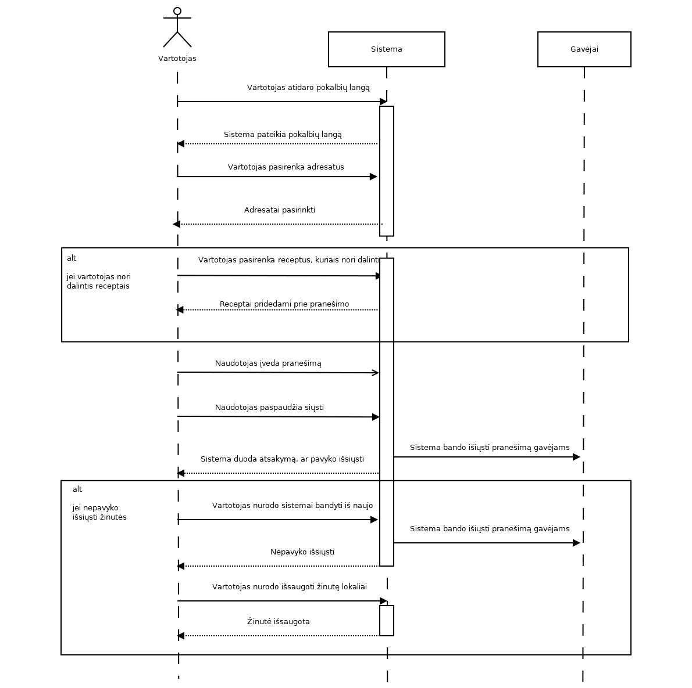

# Turinys
   
   
1. [Reikalavimai](#1-reikalavimai) 
	1. [Užsakovo poreikiai](#11-užsakovo-poreikiai) 
	2. [Vartotojiški pasakojimai](#12-vartotojiški-pasakojimai) 
2. [Dalykinės srities modelis](#2-dalykinės-srities-modelis) 
	1. [Esybių sąrašas](#21-esybių-sąrašas)
	2. [Pradinė klasių diagrama](#22-pradinė-klasių-diagrama)
	3. [Klasių ir reikalavimų matrica](#23-klasių-ir-reikalavimų-matrica)
3. [Užduotys](#3-užduotys)
	1. [Pradinė užduočių diagrama](#31-pradinė-užduočių-diagrama)
	2. [Pranešimo dėl produktų galiojimo pabaigos peržiūrėjimas](#32-pranešimo-dėl-produktų-galiojimo-pabaigos-peržiūrėjimas)
	3. [Produkto užsakymas per parduotuvę](#33-produkto-užsakymas-per-parduotuvę)
	4. [Šaldytuvo dalinimasis](#34-šaldytuvo-dalinimasis)
	5. [Naudotojas bendrauja su kitais grupės nariais per pranešimus](#35-naudotojas-bendrauja-su-kitais-grupės-nariais-per-pranešimus)
	6. [Naudotojas atsiverčia kalendorių produktams peržiūrėti](#36-naudotojas-atsiverčia-kalendorių-produktams-peržiūrėti)
	7. [Reklamų rodymas](#37-reklamų-rodymas)
	8. [Papildyta užduočių diagrama](#38-papildyta-užduočių-diagrama)
4. [Peržiūros rezultatai](#4-peržiūros-rezultatai)
    
# 1. Reikalavimai

## 1.1 Užsakovo poreikiai

 1. Pritaikyti programą mobiliesiems telefonams.
 2. Pranešti dėl atitinkamų produktų galiojimo laiko pabaigos.
 3. Galimybė užsakyti prekes per mobiliąją programą.
 4. Galimybė dalintis šaldytuvo turiniu su kitais naudotojais(grupė).
 5. Pranešimai, komentarai tarp šeimos narių dėl produktų, receptų.
 6. Kalendoriaus integracija į programą, žymint pirktus produktus pagal dienas.
 7. Numatyti galimybę atvaizduoti maisto tiekėjo pateikiamas reklamas.
 8. Aktyviai teikiama pagalba naudotojui programos naudojimo klausimais.
 9. Automatinis programos klaidų perdavimas kokybės užtikrinimo specialistams.
 10. Trumpas programos aprašas/paaiškinimas pirmą kartą ja įsijungus.

## 1.2 Vartotojiški pasakojimai
   
   
<!-- Senas lentelės formatas, neveikia su pandoc
	<table class="tg">
  <tr>
    <th class="tg-0pky" colspan="3"> Pranešimas dėl galiojimo laiko pabaigos</th>
  </tr>
  <tr>
    <td class="tg-0pky">Priėmimo testas: </td>
    <td class="tg-0pky">Prioritetas: </td>
    <td class="tg-0pky">Sąnaudos: </td>
  </tr>
  <tr>
    <td class="tg-0pky" colspan="3">Iki produkto galiojimo pabaigos likus 3 dienoms (jei jo galiojimo laikas nuo įdėjimo į šaldytuvą yra ne mažiau 5d.) ir likus 1 dienai (visada) turi būti gautas pranešimas, įspėjantis apie galiojimo laiko pabaigą ir likusį galiojimo laiką.
Jei kelių produktų galiojimo laikas sutampa, apie juos turi būti pranešama vienu bendru pranešimu.</td>
  </tr>
</table>
	Lentelės pavyzdys su Markdown sintakse
|  |
|:-------------------------------------------------------------:|
|  |
-->

| Pranešimas dėl galiojimo laiko pabaigos |
|:-----------------------------------:|
| Iki produkto galiojimo pabaigos likus 3 dienoms (jei jo galiojimo laikas nuo įdėjimo į šaldytuvą yra ne mažiau 5d.) ir likus 1 dienai (visada) turi būti gautas pranešimas, įspėjantis apie galiojimo laiko pabaigą ir likusį galiojimo laiką.   Jei kelių produktų galiojimo laikas sutampa, apie juos turi būti pranešama vienu bendru pranešimu. |
   
| Prekės užsakymas per mobiliąją programą |
|:-------------------------------------------------------------:|
| Per mobilią programą naudotojas gali ieškoti produktų ir sudaryti užsakymus. Turi būti galima pasirinkti ir užsakyti produktus. |
   

| Dalijimasis savo šaldytuvo turiniu su kitais naudotojais |
|:-------------------------------------------------------------:|
| Naudotojas, jei nori dalintis savo šaldytuvo turiniu, turi sukurti grupę. Į ją gali kviesti kitus naudotojus. Naudotojai gali atmesti arba priimti kvietimą. |
   
| Vartotojo šaldytuvo matymas |
|:-------------------------------------------------------------:|
| Turi būti galimybė matyti šaldytuvo turinį, ieškoti receptų ir pažymėti kokius receptus gaminsi. |
   
| Pranešimo sukurimas |
|:-------------------------------------------------------------:|
| Naudotojas gali palikti pranešimą, kuris matomas tik grupės nariams.  |
   
| Produkto pranešimai |
|:-------------------------------------------------------------:|
| Pranešimai skirti konkrečiam produktui arba receptui. |
   
| Pranešimų peržiūrėjimas |
|:-------------------------------------------------------------:|
| Pranešimai matomi peržiūrint produkto ar recepto informaciją. |
   
| Naudotojas atsiverčia kalendorių pirkiniams peržiūrėti |
|:-------------------------------------------------------------:|
| Naudotojas gali atsidaryti kalendorių, kuriame mato visus pirktus produktus.  Atlikus užsakymą automatiškai išsaugoma, kas ir kada buvo užsakyta, ir tai atvaizduojama kalendoriuje. Naudotojas gali pasirinkti konkrečią dieną ir matyti detalią užsakymų informaciją. Taip pat galima pažiūrėti kalendoriuje produktus pagal pristatymo datą ir galiojimo pabaigą. |
   
| Naudotojas mato reklamas |
|:-------------------------------------------------------------:|
| Produktų sąraše yra rekomenduojamos tiekėjo parinktos prekės. Šalia naudotojui aktualios informacijos yra rodomos tiekėjo reklaminės nuotraukos. Tiekėjas turi galimybę nustatyti naują reklamą ar pridėti ją į rodomų reklamų rinkinį. |
   
| Pagalba naudotojui |
|:-------------------------------------------------------------:|
| Prieš vedant informaciją į lauką ar spaudžiant mygtuką turi būti galimybė gauti informaciją apie tą mygtuką ar lauką. Informacija turi būti glausta ir suprantama. |
   
| Pranešimas dėl klaidų |
|:-------------------------------------------------------------:|
| Kai programoje įvyksta klaida, kuri sustabdo ar nutraukia veikimą, būna automatiškai pranešama specialistams. Turi būti galimybė pranešti apie klaidą, jei nesutampa gautų produktų informacija su esančia sistemoje. |
   
| Naudotojas susipažįsta su sistema |
|:-------------------------------------------------------------:|
| Per pirmą prisijungimą naudotojas supažindinamas su pagrindiniu sistemos naudojimu, pateikiant galimų veiksmų sąrašą. Naudotojui taip pat pateikiami galimi sistemos nustatymai, jis su šiais supažindinamas, ir leidžiama jam keisti nustatymus. Naudotojas gali nustatyti, kad šis paaiškinimas kitais kartais nebebus rodomas. |

# 2. Dalykinės srities modelis

## 2.1 Esybių sąrašas
 * Produktas
 * Tiekėjas
 * Naudotojas
 * Šaldytuvas
 * Receptas

## 2.2 Pradinė klasių diagrama

## 2.3 Klasių ir reikalavimų matrica

# 3. Užduotys

## 3.1 Pradinė užduočių diagrama

### 3.2. Pranešimo dėl produktų galiojimo pabaigos peržiūrėjimas

#### Užduoties vykdymą inicijuojantis trigeris
Sistemoje yra produktų, kurių galiojimo terminas artėja prie nustatytos ribos.

#### Užduoties vykdymo prieš-sąlygos
Sistemos nustatymai yra tokie, kurie leistų sistemai siųsti pranešimus.

#### Pagrindinis scenarijus
~~Artėjant produktų galiojimo laikui prie pabaigos, pagrindinio lango pranešimų juostoje pranešimų piktograma pasikeičia, nurodydama neperskaitytų pranešimų buvimą.~~ *(Reikia perrašyti pradžią, kad sistema kažką padaro ir parodo naudotojui)* Naudotojas paspaudžia ant pranešimų piktogramos. Sistema atidaro langą "Senstantys produktai". Naujame lange nurodyti produktai, kurie tuoj pasens, taip pat ir receptai iš šių produktų, jei tokių galima sudaryti. ~~Naudotojas nusprendžia gaminti pagal pasiūlytą receptą.~~ Norėdamas dalį senstančių produktų pašalinti naudotojas juos pažymi ir spaudžia pašalinti. Sistema pašalina produktus iš šaldytuvo ir atnaujina vaizduojamą informaciją.

#### Alternatyvūs scenarijai
Naudotojas nusprendžia gaminti pagal pasiūlytą receptą. Vykdomas gaminimo scenarijus.

Nėra jokių receptų, kuriuos būtų galima pagaminti iš šaldytuve esančių produktų naudojant senstančius produktus. Vietoje pasiūlyto recepto sistema parodo, jog iš esamų produktų nepavyksta sudaryti recepto. Toliau viskas kaip Naudotojui nusprendus negaminti recepto.

#### Grafinės sąsajos eskizas

#### Sekų diagrama

### 3.3. Produkto užsakymas per parduotuvę

#### Pagrindinis scenarijus
Naudotojas lange "Parduotuvė"  paspaudžia mygtuką "Įtraukti į krepšelį", kuris yra prie produkto pavadinimo. Sistema, į tai reaguodama, įtraukia produktą į krepšelio produktų sąrašą. Naudotojas, sudėjęs norimus produktus į krepšelį, norėdamas užbaigti užsakymą, spaudžia "Mano krepšelis". Sistema atidaro atitinkamai pavadintą langą. Naudotojas spaudžia "Užsakyti". Sistema suformuluoja ir išsiunčia užsakymo užklausą produktų tiekėjui.

#### Alternatyvūs scenarijai
Jei naudotojas nebenori dalies Krepšelio turinio, jis pažymi lange "Krepšelis" pažymėti žymimuosius langelius šalia nenorimų produktų pavadinimų ir paspaudžia mygtuką "Pašalinti iš krepšelio". Sistema pašalina pažymėtus elementus iš krepšelio produktų sąrašo.

#### Grafinės sąsajos eskizas 

#### Sekų diagrama

#### Peržiūros rezultatas:
1. Sukurti atskirą scenarijų: "Užsakymas produktų per šaldytuvą"

Jei naudotojas nori į krepšelį įtraukti jau pirktus produktus, lange "Šaldytuvas" šalia norimo produkto gali paspausti pliuso ženklą. Sistema įtraukia identišką produktą į krepšelį.

### 3.4. Šaldytuvo dalinimasis

#### Pagrindinis scenarijus
Naudotojas, norėdamas dalintis šaldytuvu, lange "Šaldytuvas" spaudžia mygtuką "Dalintis". Sistema parodo langą "Dalinimasis" su jame esančia naudotojų informacija. Naudotojas pažymi žymimuosius langelius prie naudotojų vardų, su kuriais nori dalintis šaldytuvu, ir paspaudžia mygtuką "Patvirtinti". Sistema išsiunčia kvietimą kitiems naudotojams. Jei kitas naudotojas priima pakvietimą, sistema atverčia langą "Pranešimas", su informacija, kas priėmė. 

#### Alternatyvūs scenarijai
Naudotojas lange "Dalinimasis" paspaudžia mygtuką "Atšaukti". Sistema pašalina visus tame lange buvusius pasirinkimus. Sistema tada sugrąžina naudotoją į langą "Šaldytuvas".

#### Grafinės sąsajos eskizas
.png "'Dalintis'")

#### Sekų diagrama

### 3.5. Naudotojas bendrauja su kitais grupės nariais per pranešimus

#### Pagrindinis scenarijus
Naudotojas, norėdamas pasidalinti receptais su kitais naudotojais, paspaudžia pokalbių skirsnio piktogramą, esančią pagrindinio lango viršuje. Atsidaro pokalbių langas, kuriame naudotojas gali susirašinėti su kitais naudotojais. Naudotojas pasirenka, su kuo susirašinėti iš pateikto sąrašo. Šiame lange yra susirašinėjimui skirtas plotas. Naudotojas paspaudžia mygtuką "Dalintis receptais", atsidariusiame lange naudotojas pažymi receptus, kuriais nori dalintis. Iš pasirinktų receptų automatiškai sugeneruojamas pranešimo tekstas. Naudotojas paspaudžia mygtuką "Siųsti", ir pranešimas išsiunčiamas gavėjui.  

#### Alternatyvus scenarijus
Dėl kokių nors priežasčių pranešimo nepavyko nusiųsti. Sistema informuoją naudotoją apie tai ir nurodo to priežastį. Naudotojui leidžiama pabandyti siųsti iš naujo. Naudotojas, po kelių nesėkmingų bandymų, laikinai išsaugo šį pranešimą lokaliai, kad vėliau galėtų pabandyti jį išsiųsti.  

#### Grafinės sąsajos eskizas
  

#### Sekų diagrama
  

### 3.6. Naudotojas atsiverčia kalendorių produktams peržiūrėti

#### Pagrindinis scenarijus
Kalendoriaus lange naudotojui automatiškai pavaizduojamas esamas mėnesis. Sistema automatiškai pavaizduoja kiekvieną užsakymą ties diena, kada buvo užsakyta. Naudotojas spaudžia ant pliuso prie dienos. Sistema suranda dienos užsakymų informaciją ir atvaizduoja ją lange "Dienos produktai". Peržiūrėdamas produktus naudotojas pasirenka vieną ir spaudžia „Užsakyti daugiau“. Sistema suranda produktą ir įdeda jį į naudotojo krepšelį. Naudotojas spaudžia "Grįžti". Sistema grąžina naudotoją į kalendoriaus langą.  

#### Alternatyvūs scenarijai  
Naudotojas spaudžia „žiūrėti pagal galiojimo laiką“.  Sistema atvaizduoja mėnesyje produktų galiojimo pabaigas. Naudotojas pasirenka dieną ir spaudžia „Peržiūrėti“. Sistema atvaizduoja produktus lange „Dienos produktai“. Norėdamas išvengti pasenusio maisto naudotojas spaudžia „siūlyti receptus“.  Sistema ieško receptų, su produktais, kurie pasirinktą dieną baigs galioti. Sistema nuveda naudotoją į receptų langą ir pavaizduoja rastus receptus. Naudotojas išsirenka receptą ir spaudžia "gaminti". Sistema pašalina produktus, atnaujina vaizduojamą informaciją. Naudotojas grąžinamas į kalendoriaus langą.  
Naudotojas pasirenka kurių nors metų kokį nors mėnesį. Sistema atvaizduoja to mėnesio užsakytus produktus. Tada scenarijus tęsiasi kaip pagrindinis, tik su pasirinktu mėnesiu.  

#### Grafinės sąsajos eskizas
  

#### Sekų diagrama  
  

### 3.7. Reklamų rodymas  

#### Pagrindinis scenarijus  
Naudotojui naršant "Mano produktai" arba "Visi produktai" meniu sistema kartais įterpia reklamą tarp rodomų produktų. Reklama yra tokio paties dydžio kaip ir produktų paveikslėliai, tačiau skiriasi kraštinės spalva. Naudotojas paspaudžia ant reklamos. Sistema nukreipia naudotoją į reklamos nuorodą. 

#### Alternatyvūs scenarijai
Jei reklama yra nuolaida produktui šioje sistemoje, tai sistema reaguodama į paspaudimą duoda pasirinkimą nurodytą produktą įtraukti į krepšelį su atitinkama kaina. Naudotojas paspaudžia sutikti. Sistema įtraukia produktą į krepšelį.

Naudotojas nenorėdamas matyti reklamos, spaudžia jos kampe esantį "x" mygtuką. Sistema paslepia reklamą ir vietoje jos vaizduoja produktą.

Naudotojui paspaudus dešinį pelės mygtuką (arba ilgai palietus, jei naudojamasi mobiliąją versija) sistema parodo pasirinkimą pranešti apie netinkamą reklamos turinį. Naudotojas spaudžia "pranešti". Sistema atidaro dialogą, kuriame prašoma nurodyti priežastį, kodėl ta reklama yra netinkama. Naudotojas suveda informaciją ir spaudžia "patvirtina". Sistema neberodo jam šios reklamos ir persiunčia pranešimą dėl netinkamo turinio sistemos administratoriams, kurie nuspręs, ar dėl tos reklamos reikia imtis tolimesnių veiksmų.

#### Grafinės sąsajos eskizas

#### Sekų diagrama

### 3.8 Papildyta užduočių diagrama

# 4. Peržiūros rezultatai
[Pataisyta reikalavimų specifikacija.](https://1drv.ms/w/s!Ao3LSVKqY6TXg8t2cWLC-LfMPbrOEg) Raudonu šriftu žymimi nauji reikalavimai. 

Užduočių ir reikalavimų atsekamumo matricos nepateiksime. Užduočių scenarijų tekstai yra parašyti įgyvendinant 2-7 užsakovo reikalavimus. Taip pat kiekviena užduotis įgyvendina pirmąjį užsakovo reikalavimą.

Pridėta trūkstamas 4 užduoties GUI.

Patikslinta klasių diagramą, klasei "naudotojas" pridėjas atributas "vardas".
