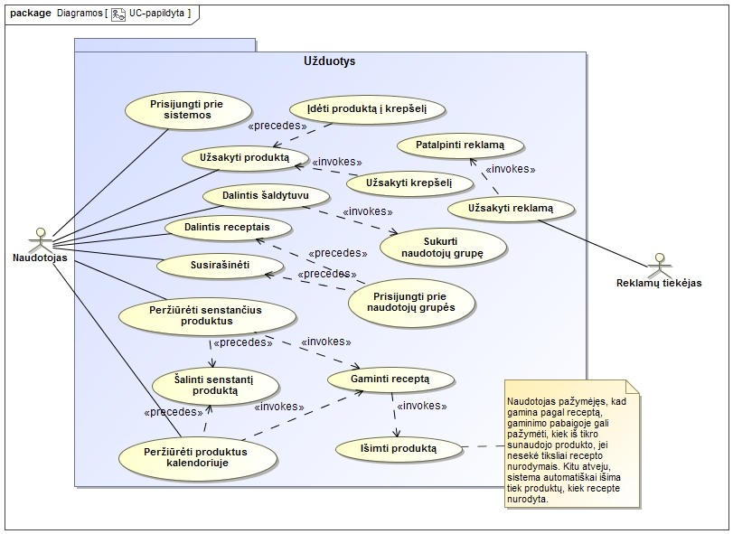

# Turinys
   
   
1. [Reikalavimai](#1-reikalavimai) 
	1. [Užsakovo poreikiai](#11-užsakovo-poreikiai) 
	2. [Vartotojiški pasakojimai](#12-vartotojiški-pasakojimai)
	3. [Interfeiso reikalavimai](#13-interfeiso-reikalavimai)
2. [Dalykinės srities modelis](#2-dalykinės-srities-modelis) 
	1. [Esybių sąrašas](#21-esybių-sąrašas)
	2. [Pradinė klasių diagrama](#22-pradinė-klasių-diagrama)
	3. [Klasių ir reikalavimų matrica](#23-klasių-ir-reikalavimų-matrica)
3. [Užduotys](#3-užduotys)
	1. [Pradinė užduočių diagrama](#31-pradinė-užduočių-diagrama)
	2. [Pranešimo dėl produktų galiojimo pabaigos peržiūrėjimas](#32-pranešimo-dėl-produktų-galiojimo-pabaigos-peržiūrėjimas)
	3. [Produkto užsakymas per parduotuvę](#33-produkto-užsakymas-per-parduotuvę)
	4. [Šaldytuvo dalinimasis](#34-šaldytuvo-dalinimasis)
	5. [Naudotojas bendrauja su kitais grupės nariais per pranešimus](#35-naudotojas-bendrauja-su-kitais-grupės-nariais-per-pranešimus)
	6. [Naudotojas atsiverčia kalendorių produktams peržiūrėti](#36-naudotojas-atsiverčia-kalendorių-produktams-peržiūrėti)
	7. [Reklamų rodymas](#37-reklamų-rodymas)
	8. [Papildyta užduočių diagrama](#38-papildyta-užduočių-diagrama)
4. [Detalaus projektavimo peržiūra](#4-detalaus-projektavimo-peržiūra)
	1. [Pranešimas dėl senstančių produktų](#41-pranešimas-dėl-senstančių-produktų)
	2. [Dalinimasis šaldytuvu](#42-dalinimasis-šaldytuvu)
	3. [Bendravimas pranešimais](#43-bendravimas-pranešimais)
	4. [Kalendoriaus naudojimas](#44-kalendoriaus-naudojimas)
	5. [Reklamų peržiūra](#45-reklamų-peržiūra)
	6. [Pakeisti projektiniai sprendimai](#46-pakeisti-projektiniai-sprendimai)
5. [Testavimo planas ir scenarijai](#5-testavimo-planas-ir-scenarijai)
6. [Techninė architektūra](#6-techninė-architektūra)
	1. [Sistemos architektūra](#61-sistemos-komponentai)
	2. [Fizinis pjūvis](#62-fizinis-pjūvis)
7. [Sistemos realizacija](#7-sistemos-realizacija)
	1. [Duomenų bazės schema](#71-duomenų-bazės-schema)
	2. [Pradiniai programų kodai](#72-pradiniai-programų-kodai)
	
<!-- pagebreak -->

# 1. Reikalavimai

## 1.1 Užsakovo poreikiai

 1. Pritaikyti programą mobiliesiems telefonams.
 2. Pranešti dėl atitinkamų produktų galiojimo laiko pabaigos.
 3. Galimybė užsakyti prekes per mobiliąją programą.
 4. Galimybė dalintis šaldytuvo turiniu su kitais naudotojais(grupė).
 5. Pranešimai, komentarai tarp šeimos narių dėl produktų, receptų.
 6. Kalendoriaus integracija į programą, žymint pirktus produktus pagal dienas.
 7. Numatyti galimybę atvaizduoti maisto tiekėjo pateikiamas reklamas.
 8. Aktyviai teikiama pagalba naudotojui programos naudojimo klausimais.
 9. Automatinis programos klaidų perdavimas kokybės užtikrinimo specialistams.
 10. Trumpas programos aprašas/paaiškinimas pirmą kartą ja įsijungus.

## 1.2 Vartotojiški pasakojimai
   
| Pranešimas dėl galiojimo laiko pabaigos |
|:-----------------------------------:|
| Iki produkto galiojimo pabaigos likus 3 dienoms (jei jo galiojimo laikas nuo įdėjimo į šaldytuvą yra ne mažiau 5d.) ir likus 1 dienai (visada) turi būti gautas pranešimas, įspėjantis apie galiojimo laiko pabaigą ir likusį galiojimo laiką.   Jei kelių produktų galiojimo laikas sutampa, apie juos turi būti pranešama vienu bendru pranešimu. |
   
| Prekės užsakymas per mobiliojo programą |
|:-------------------------------------------------------------:|
| Mobiliojo programoje naudotojas gali ieškoti, kokius produktus parduoda tiekėjai. Turi būti langas, kuriame galima peržiūrėti prekes, jas užsakyti arba įtraukti į krepšelį. Turi būti galimybė atskirame lange redaguoti krepšelio turinį ir užsakyti arba atšaukti.|
   

| Dalijimasis savo šaldytuvo turiniu su kitais naudotojais |
|:-------------------------------------------------------------:|
| Naudotojas, jei nori dalintis savo šaldytuvo turiniu, turi sukurti grupę. Į ją gali kviesti kitus naudotojus. Naudotojai gali atmesti arba priimti kvietimą. Sukurtoje grupėje turi būti galimybė dalintis ir receptais.|
   
| Šaldytuvo informacijos peržiūrėjimas |
|:-------------------------------------------------------------:|
| Turi būti galimybė matyti šaldytuvo turinį, ieškoti receptų ir pažymėti kokius receptus gaminsi. Reikalinga paieška, kad būtų galima patogiai surasti norimą produktą ar panašius produktus.|
   
| Bendravimas apie receptus |
|:-------------------------------------------------------------:|
| Turi būti galimybė pranešti grupės nariams apie naujo recepto sukūrimą arba kokią kitą naujieną (pvz., šaldytuvas sugedo). Nariai atsakydami rašo komentarus, matomus taip pat visiems.|
   
| Produktų komentavimas |
|:-------------------------------------------------------------:|
| Turi būti galimybė grupės nariui rašyti apie konkretų produktą. Naudotojas turi galėti redaguoti ir ištrinti savo komentarus. |
   
| Pranešimų peržiūrėjimas |
|:-------------------------------------------------------------:|
| Pranešimai ir su jais susiję komentarai matomi peržiūrint produkto ar recepto informaciją. |
   
| Naudotojas atsiverčia kalendorių pirkiniams peržiūrėti |
|:-------------------------------------------------------------:|
| Naudotojas gali atsidaryti kalendorių, kuriame mato visus pirktus produktus. Atlikus užsakymą automatiškai išsaugoma, kas ir kada buvo užsakyta, ir tai atvaizduojama. Naudotojas gali pasirinkti konkrečią dieną ir matyti detalią užsakymų informaciją. Taip pat galima pažiūrėti kalendoriuje produktus pagal pristatymo datą ir galiojimo pabaigą. |
   
| Reklamų talpinimas |
|:-------------------------------------------------------------:|
| Turi būti galimybė nustatyti naują reklamą ar pridėti ją į rodomų reklamų rinkinį. Turi būti pasirinkimas patalpinti konkretaus produkto reklamą, kuri būtų matoma tarp naudotojo turimų produktų ar galimų pirkinių, arba reklaminį skelbimą, kuris būtų šalia naudotojui aktualios informacijos.|

| Reklamų peržiūrėjimas |
|:-------------------------------------------------------------:|
| Turi būti galimybė paspausti ant sudominusios reklamos ir naršyklėje pamatyti jos turinį, nebent reklamuojamą produktą galima įsigyti naudojantis programa. Taip pat turi būti galimybė uždaryti nemėgstamas reklamas ir pranešti apie netinkamo turinio reklamas. |

   
| Pagalba naudotojantis sistema |
|:-------------------------------------------------------------:|
| Prieš vedant informaciją į lauką ar spaudžiant mygtuką turi būti galimybė gauti informaciją apie tą mygtuką ar lauką. Informacija turi būti glausta ir suprantama. |
   
| Pranešimas dėl klaidų |
|:-------------------------------------------------------------:|
| Kai programoje įvyksta klaida, kuri sustabdo ar nutraukia veikimą, būna automatiškai pranešama specialistams. Turi būti galimybė pranešti apie klaidą, jei nesutampa gautų produktų informacija. |
   
| Naudotojas susipažįsta su sistema |
|:-------------------------------------------------------------:|
| Per pirmą prisijungimą naudotojas turi būti supažindinamas su pagrindiniu sistemos naudojimu, pateikiant galimų veiksmų sąrašą. Naudotojui taip pat pateikiami galimi sistemos nustatymai, jis su šiais supažindinamas, ir leidžiama jam keisti nustatymus. Naudotojas gali nustatyti, kad šis paaiškinimas kitais kartais nebebus rodomas. |

## 1.3 Interfeiso reikalavimai

### 1.3.1 Grafinės sąsajos eskizai

<!-- pagebreak -->
#### 1.3.1.1 Langas "Senstantys produktai"

Paveikslėlyje 1.3.1.1 pavaizduotas produktų peržiūros langas, kuriame išryškinti senstantys produktai. Lango apačioje yra siūlomi receptai, kurių sudėtyje yra pažymėti senstantys produktai.

Šaldytuvo lange numatoma vaizduoti visus vartotojo šaldytuve esančius produktus, galimybė juos papildyti (pereinama prie užsakymo) ir mygtukas pereiti prie senstančių produktų lango (Žr. 1.3.1.3).

<!-- pagebreak -->
#### 1.3.1.2 Langas "Produktų užsakymas"

Figūroje 1.3.1.2 pavaizduoti parduotuvės ir krepšelio grafinės sąsajos eskizai. Abiejuose languose yra duota galimybė pereiti į kitus sistemos langus (sąsajos apačioje).

Parduotuvės lange yra numatoma rodyti produktą, jo aprašymą ir mygtuką pridėti produktą į krepšelį.

Krepšelio lange yra numatoma rodyti visus vartotojo į krepšelį pridėtus produktus, galimybė juos žymėti ir pažymėtus produktus arba šalinti iš krepšelio, arba juos užsakyti.

<!-- pagebreak -->
#### 1.3.1.3 Langai "Šaldytuvas" ir "Dalintis"

Figūroje 1.3.1.3 pavaizduota numatoma šaldytuvo dalinimosi grafinė sąsaja (bei numatomas būdas į ją pereiti iš šaldytuvo lango). Šiame lange yra rodomi kitų vartotojų vardai ir galimybė tuos vartotojus pažymėt, kad su jais tęsti dalinimąsi.

<!-- pagebreak -->
#### 1.1.3.4 Langas "Bendravimas grupėje"
  

Figūroje 1.3.1.4 pavaizduotos numatomos grafinės sąsajos pokalbiai bei receptų dalinimasis. Pokalbių lange figūruoja pokalbio gija, kurioje rodomi visi iki šiol toje grupėje su vartotoju pasidalinti receptai, tos grupės nariai, kuriuos galima pasirinkti, bei patvirtinimo mygtukas dalintis receptais, kuris nukreipia į receptų dalinimosi langą, kuriame galima pasirinkti receptus, kuriais norima dalintis.

<!-- pagebreak -->
#### 1.1.3.5 Langas "Kalendorius" ir "Dienos užsakymai"
  

Figūroje 1.3.1.5 pavaizduoti kalendoriaus ir dienos aprašymo langai. Iš kalendoriaus patenkama į dienos langą paspaudžiant "+" mygtuką prie dienos. Kiekviena mėnesio diena, kurios metu buvo gautas užsakymas, turi aktyvų "+" mygtuką. Dienos lange yra pavaizduoti užsakymai ir jais gauti produktai: pavadinimai, kiekiai, kainos. Ties kiekvienu produktu galima pasirinkti užsakyti daugiau to produkto. Kalendoriaus lango viršuje yra mygtukai, leidžiantys žiūrėti produktus pagal pasirinktą metriką: užsakymo datą arba galiojimo laiką. Dienos lange leidžiama ieškoti receptų su dienos produktais, kas yra itin svarbu, jei tie produktai artimiausiu metu baigs galioti.

<!-- pagebreak -->
#### 1.3.1.6 Reklamų vaizdavimas produktų peržiūros metu

Figūroje 1.3.1.6 yra pavaizduota numatoma grafinės sąsajos dalis kuri yra skirta būti bent kuriame produktus rodančiame lange. Naršant produktus, kaip pavaizduota, kartais yra įterpiama reklama, kuri nuo kitų produktų skiriasi savo kraštinės spalva (produktai apibrėžti juodai, o reklama mėlynai), bei tuo, kad kampe turi "x" mygtuką.

### 1.3.2 Vartotojo ir sistemos sąveika vykdant užduotis

<!-- pagebreak -->
#### 1.3.2.1 Pranešimo dėl produktų galiojimo pabaigos peržiūrėjimas

Sekų diagramoje 1.3.2.1 parodomi žingsniai, kuriuos sistema vykdo sąveikaudama su vartotoju vykdant pagrindinį ir/ar alternatyvius scenarijus, kai sistemoje yra senstančių produktų. 

<!-- pagebreak -->
#### 1.3.2.2 Produktų užsakymas

Sekų diagramoje 1.3.2.2 parodomi žingsniai, kuriuos sistema vykdo sąveikaudama su vartotoju vykdant pagrindinį ir/ar alternatyvius scenarijus, kai vartotojas nori užsisakyti produktus parduotuvės lange.

<!-- pagebreak -->
#### 1.3.2.3 Šaldytuvo dalinimasis

Sekų diagramoje 1.3.2.3 parodomi žingsniai, kuriuos sistema vykdo sąveikaudama su vartotoju vykdant pagrindinį ir/ar alternatyvius scenarijus, kai vartotojas nori su kitais vartotojais dalintis savo šaldytuvo turiniu.

<!-- pagebreak -->
#### 1.3.2.4 Bendravimas tarp grupės narių

Sekų diagramoje 1.3.2.4 parodomi žingsniai, kuriuos sistema vykdo sąveikaudama su vartotoju vykdant pagrindinį ir/ar alternatyvius scenarijus, kai vartotojas nori su kitais vartotojais grupėje dalintis savo receptais.

<!-- pagebreak -->
#### 1.3.2.5 Produktų peržiūra kalendoriuje
   

Figūroje 1.3.2.5 yra pavaizduota diagrama, nurodanti naudotojo bendravimo su sistema veiksmų seką. Sistema, reaguodama į naudotojo paspaudimus atidaro tam tikrus langus ir atlieka tam tikras operacijas. Naudotojas pirma sąveikauja su kalendoriaus langu, tada paspaudęs ant "+" ties mėnesio diena - su dienos produktų langu. Produktų lange paspaudęs "grįžti" yra grąžinamas į kalendoriaus langą. 

<!-- pagebreak -->
#### 1.3.2.6 Naudotojo sąveika su reklamomis
 

Sekų diagramoje 1.3.2.6 parodomi žingsniai, kuriuos sistema vykdo sąveikaudama su vartotoju vykdant pagrindinį ir/ar alternatyvius scenarijus, kai vartotojas sąveikauja (arba ne) su reklama - arba teigiamai (paspausdamas ją), arba neigiamai ("x" mygtuku ją panaikindamas, arba pranešdamas apie netinkamą turinį).

## 1.4 Reikalavimų specifikacija

[Pataisyta reikalavimų specifikacija.](https://1drv.ms/w/s!Ao3LSVKqY6TXg8t2cWLC-LfMPbrOEg) Raudonu šriftu žymimi nauji reikalavimai. 

<!-- pagebreak -->
# 2. Dalykinės srities modelis

## 2.1 Esybių sąrašas
 * Produktas
 * Pranešimas
 * Grupė
 * Užsakymas
 * Tiekėjas
 * Naudotojas
 * Šaldytuvas
 * Receptas

## 2.2 Pradinė klasių diagrama

Dalykinės srites struktūrą galima pamatyti 2.2. diagramoje. Svarbiausia klasė yra naudotojo paskyra. Ją sukuria naudotojas prisiregistruodamas. Naudotojai sudaro grupes, kuriose dalinasi receptais per pranešimus. Produktai yra teikiami produktų tiekėjo, reklamos - reklamų tiekėjo. Kiekvienas naudotojas turi savo šaldytuvą ir gali juo dalintis su naudotojų grupe.

## 2.3 Klasių ir reikalavimų matrica

Klasių ir reikalavimų matricoje (figūra 2.3) nurodomi sąryšiai tarp užsakovo reikalavimų ir dalykinės srities klasių. Matosi, kad svarbiausia klasė yra naudotojo paskyra. Visi reikalavimai yra įgyvendinami bent viena klase ir kiekviena klasė įgyvendina bent vieną reikalavimą.

<!-- pagebreak -->
# 3. Užduotys

## 3.1 Pradinė užduočių diagrama

3.1 diagramoje pavaizduotos pagrindinės sistemos naudotojų užduotys. Naudotojas siekia prisijungęs prie sistemos užsakyti produktus, dalintis receptais, savo šaldytuvo turiniu, peržiūrėti turimus produktus kalendoriuje bei peržiūrėti pranešimus dėl senstančių produktų. Reklamų tiekėjas siekia užsakyti reklamą, t.y., kad sistema rodytų jo reklamą naudotojams.

<!-- pagebreak -->
### 3.2. Pranešimo dėl produktų galiojimo pabaigos peržiūrėjimas

#### Užduoties vykdymą inicijuojantis trigeris
~~Sistemoje yra produktų, kurių galiojimo terminas artėja prie nustatytos ribos.~~
Sistemoje aptinkamas vienas ar daugiau produktų kurių galiojimo data skiriasi nuo esamos datos per vartotojo nustatytą dienų skaičių. (Toliau: senstantis produktas)

#### Užduoties vykdymo prieš-sąlygos
Sistemos nustatymai yra tokie, kurie leistų sistemai siųsti pranešimus.

#### Pagrindinis scenarijus
Naudotojas yra informuojamas pranešimų piktogramos pranešimų juostoje spalvos pasikeitimu, kad esama senstančių produktų. Naudotojas paspaudžia ant pranešimų piktogramos. Sistema atidaro langą "Senstantys produktai". Naujame lange nurodyti produktai, kurie tuoj pasens, taip pat ir receptai iš šių produktų, jei tokių galima sudaryti. Naudotojas pasirenka vieną iš pasiūlytų receptų ir spaudžia mygtuką "Gaminti". Norėdamas dalį senstančių produktų pašalinti naudotojas juos pažymi ir spaudžia pašalinti. Sistema pašalina produktus iš šaldytuvo ir atnaujina vaizduojamą informaciją.

#### Alternatyvūs scenarijai
Nėra jokių receptų, kuriuos būtų galima pagaminti iš šaldytuve esančių produktų naudojant senstančius produktus. Vietoje pasiūlyto recepto sistema parodo, jog iš esamų produktų nepavyksta sudaryti recepto. Norėdamas visus ar dalį senstančių produktų pašalinti naudotojas juos pažymi ir spaudžia pašalinti. Sistema pašalina produktus iš šaldytuvo ir atnaujina vaizduojamą informaciją.  

<!-- pagebreak -->
#### Robustiškumo diagrama

Robustiškumo diagramoje 3.2.1 pavaizduotos kokios veiklos vyksta sistemoje, kai vartotojas sąveikauja su grafine sąsaja, kurioje rodomi senstantys produktai.

<!-- pagebreak -->
### 3.3. Produkto užsakymas per parduotuvę

#### Pagrindinis scenarijus
Naudotojas lange "Parduotuvė"  paspaudžia mygtuką "Įtraukti į krepšelį", kuris yra prie produkto pavadinimo. Sistema, į tai reaguodama, įtraukia produktą į krepšelio produktų sąrašą. Naudotojas, sudėjęs norimus produktus į krepšelį, norėdamas užbaigti užsakymą, spaudžia "Mano krepšelis". Sistema atidaro atitinkamai pavadintą langą. Naudotojas spaudžia "Užsakyti". Sistema suformuluoja ir išsiunčia užsakymo užklausą produktų tiekėjui.

#### Alternatyvūs scenarijai
Jei naudotojas nebenori dalies Krepšelio turinio, jis pažymi lange "Krepšelis" žymimuosius langelius šalia nenorimų produktų pavadinimų ir paspaudžia mygtuką "Pašalinti iš krepšelio". Sistema pašalina pažymėtus elementus iš krepšelio produktų sąrašo.

<!-- pagebreak -->
#### Robustiškumo diagrama

Robustiškumo diagramoje 3.3.1 pavaizduotos kokios veiklos vyksta sistemoje, kai vartotojas sąveikauja su parduotuvės ir/ar krepšelio grafinėmis sąsajomis.

<!-- pagebreak -->
### 3.4. Šaldytuvo dalinimasis

#### Pagrindinis scenarijus
Naudotojas, norėdamas dalintis šaldytuvu, lange "Šaldytuvas" spaudžia mygtuką "Dalintis". Sistema parodo langą "Dalinimasis" su jame esančia naudotojų informacija. Naudotojas pažymi žymimuosius langelius prie naudotojų vardų, su kuriais nori dalintis šaldytuvu, ir paspaudžia mygtuką "Patvirtinti". Sistema išsiunčia kvietimą kitiems naudotojams. 

#### Alternatyvūs scenarijai
Naudotojas lange "Dalinimasis" paspaudžia mygtuką "Atšaukti". Sistema pašalina visus tame lange buvusius pasirinkimus. Sistema tada sugrąžina naudotoją į langą "Šaldytuvas".

<!-- pagebreak -->
#### Robustiškumo diagrama

Robustiškumo diagramoje 3.4.1 pavaizduotos kokios veiklos vyksta sistemoje, kai vartotojas sąveikauja su šaldytuvo dalinimosi grafine sąsaja, bei veiklos, nusakančios kaip vartotojas į šią sąsają patenka iš šaldytuvo lango.

<!-- pagebreak -->
### 3.5. Naudotojas bendrauja su kitais grupės nariais per pranešimus

#### Pagrindinis scenarijus
Naudotojas pokalbių lange paspaudžia "Rašyti pranešimą". Sistema susiranda naudotojų grupę, kurią tuo metu yra pasirinkęs vartotojas, ir pavaizduoja sąraše visus narius kaip galimus gavėjus. Naudotojas pasirenka, kam nori siųsti pranešimą. Sistema aktyvuoja susirašinėjimui skirtą plotą. Naudotojas šiame plote parašo pranešimo tekstą ir paspaudžia mygtuką "Siųsti". Pranešimas išsiunčiamas pasirinktiems gavėjams.  

#### Alternatyvus scenarijus
Jei naudotojas nori pasidalinti receptu, jis, pasirinkęs su kuo susirašinėti, paspaudžia mygtuką "Dalintis receptais". Atsidariusiame receptų lange naudotojas pažymi receptus, kuriais nori dalintis, tada spaudžia mygtuką "Patvirtinti". Pasirinkti receptai pridedami prie pranešimo.

Dėl kokių nors priežasčių pranešimo nepavyko nusiųsti. Sistema informuoją naudotoją apie tai ir nurodo to priežastį. Naudotojui leidžiama pabandyti siųsti iš naujo. Naudotojas, po kelių nesėkmingų bandymų, paspaudžia "atšaukti". Sistema uždaro sisteminį pranešimą ir grįžtama į pokalbių langą.

<!-- pagebreak -->
#### Robustiškumo diagrama

Robustiškumo diagramoje 3.5.1 pavaizduotos kokios veiklos vyksta sistemoje, kai vartotojas sąveikauja su pokalbių langu, o vėliau galimai receptų dalinimosi langu bei pradinis atsiradimo pokalbių lange procesas.

<!-- pagebreak -->
### 3.6. Naudotojas atsiverčia kalendorių produktams peržiūrėti

#### Pagrindinis scenarijus
Kalendoriaus lange naudotojui automatiškai pavaizduojamas esamas mėnesis. Sistema automatiškai pavaizduoja kiekvieną užsakymą ties diena, kada buvo užsakyta. Naudotojas spaudžia ant pliuso prie dienos. Sistema suranda dienos užsakymų informaciją ir atvaizduoja ją lange "Dienos produktai". Peržiūrėdamas produktus naudotojas pasirenka vieną ir spaudžia „Užsakyti daugiau“. Sistema suranda produktą ir įdeda jį į naudotojo krepšelį. Naudotojas spaudžia "Grįžti". Sistema grąžina naudotoją į kalendoriaus langą.  

#### Alternatyvūs scenarijai  
Naudotojas spaudžia „žiūrėti pagal galiojimo laiką“.  Sistema atvaizduoja mėnesyje produktų galiojimo pabaigas. Naudotojas pasirenka dieną ir spaudžia „Peržiūrėti“. Sistema atvaizduoja produktus lange „Dienos produktai“. Norėdamas išvengti pasenusio maisto naudotojas spaudžia „siūlyti receptus“.  Sistema ieško receptų, su produktais, kurie pasirinktą dieną baigs galioti. Sistema nuveda naudotoją į receptų langą ir pavaizduoja rastus receptus. Naudotojas išsirenka receptą ir spaudžia "gaminti". Sistema pašalina produktus, atnaujina vaizduojamą informaciją. Naudotojas grąžinamas į kalendoriaus langą.  
Naudotojas pasirenka kurių nors metų kokį nors mėnesį. Sistema atvaizduoja to mėnesio užsakytus produktus. Tada scenarijus tęsiasi kaip pagrindinis, tik su pasirinktu mėnesiu.  

<!-- pagebreak -->
#### Robustiškumo diagrama

Figūroje 3.6.1 pavaizduotoje robustiškumo diagramoje pavaizduotas pagrindinis užduoties scenarijus ir alternatyvieji per objektus. Naudotojas sąveikauja pirma su kalendoriaus langu, tada su dienos produktų, o šiame lange pasirinkęs gauti receptus - su receptų langu.

<!-- pagebreak -->
### 3.7. Reklamų rodymas  

#### Pagrindinis scenarijus  
Naudotojui naršant "Mano produktai" arba "Visi produktai" meniu sistema kartais įterpia reklamą tarp rodomų produktų. Reklama yra tokio paties dydžio kaip ir produktų paveikslėliai, tačiau skiriasi kraštinės spalva. Naudotojas paspaudžia ant reklamos. Sistema nukreipia naudotoją į reklamos nuorodą. 

#### Alternatyvūs scenarijai
Jei reklama yra nuolaida produktui šioje sistemoje, tai sistema reaguodama į paspaudimą duoda pasirinkimą nurodytą produktą įtraukti į krepšelį su atitinkama kaina. Naudotojas paspaudžia sutikti. Sistema įtraukia produktą į krepšelį.

Naudotojas nenorėdamas matyti reklamos, spaudžia jos kampe esantį "x" mygtuką. Sistema paslepia reklamą ir vietoje jos vaizduoja produktą.

Naudotojui paspaudus dešinį pelės mygtuką (arba ilgai palietus, jei naudojamasi mobiliąją versija) sistema parodo pasirinkimą pranešti apie netinkamą reklamos turinį. Naudotojas spaudžia "pranešti". Sistema atidaro dialogą, kuriame prašoma nurodyti priežastį, kodėl ta reklama yra netinkama. Naudotojas suveda informaciją ir spaudžia "patvirtina". Sistema neberodo jam šios reklamos ir persiunčia pranešimą dėl netinkamo turinio sistemos administratoriams, kurie nuspręs, ar dėl tos reklamos reikia imtis tolimesnių veiksmų.

<!-- pagebreak -->
#### Robustiškumo diagrama

Robustiškumo diagramoje 3.7.1 pavaizduotos kokios veiklų sekos vyksta sistemoje, kai vartotojas teigiamai arba neigiamai sąveikauja su reklama.

<!-- pagebreak --> 
### 3.8 Papildyta užduočių diagrama

 

Figūroje 3.8 yra pavaizduota detalesnė užduočių diagrama. Joje yra ne tik aprašyti užduočių scenarijai, bet ir pastebėti kiti, logiškai vykdomi prieš ar po aprašytų scenarijų. Numatyta, kad naudotojas gali dalintis receptais ir bendrauti pranešimais tik prisijungęs prie naudotojų grupės. Naudotojas dalindamasis šaldytuvu sukuria naują grupę, nebent dalinasi su grupe, kurios yra narys. Kad naudotojas užsakytų produktą, turi jį įdėti į krepšelį. Tik užsakius krepšelį produktas bus laikomas užsakytu. Reklamų tiekėjas užsakydamas reklamą patalpina ją į sistemą.

Naudotojas peržiūrėdamas senstančius produktus pranešimuose ar kalendoriuje gali ieškoti tokių receptų, kuriais išvengtų sugedusio maisto. Jei naudotojas nenori gaminti ar neįmanoma sudaryti tokių receptų, jam leidžiama šalinti senstančius produktus iš sistemos. Naudotojas pažymi, kad gamina receptą, sistema pateikia gamybos informaciją ir kitokią pagalbą. Gaminimo pabaigoje sistema automatiškai pašalina sunaudotus produktus.

<!-- pagebreak -->
# 4 Detalaus projektavimo peržiūra

## Pakeitimai:
Kiekviename punkte surašote pataisymus, tiek teksto, tiek sekų diagramos, tiek robustiškumo diagramos. Robustiškumo diagramas taisyti tik tada, kai žymiai keičiasi UC tekstas.

## 4.1 Pranešimas dėl senstančių produktų
- .
- .

## 4.2 Dalinimasis šaldytuvu
- Iš užduoties scenarijaus pašalintas pranešimo gavimas, kai pakvietas vartotojas priima kvietimą, ir tai perkelta į "Kvietimo Priėmimo" užduoties scenarijų
- Sekų diagrama išversta į anglų kalbą
- Robustiškumo diagrama pakeista, kad atitiktų naują užduoties scenarijaus tekstą

## 4.3 Bendravimas pranešimais
- .
- .

## 4.4 Kalendoriaus naudojimas
- .
- .

## 4.5 Reklamų peržiūra
- Pakeista robustiškumo diagrama: nupigintos prekės pridėjimas į krepšelį perduotas kitam užduoties scenarijui; patikslinta, kad nukreipiant į 3 šalies reklamos turinį dalyvauja kitas aktorius; patikslinta, kad sis. administratoriai ir reklamos tiekėjai mato pranešimus apie netinkamą reklamą informaciniame lange.
- .

## 4.6 Pakeisti projektiniai sprendimai
- Nuspresta iš MVC architektūros pereiti prie MVP, nes MVP labiau priimtina komandai, nes turime daugiau patirties, ir dažniau taikoma praktikoje
- Nuspresta programuoti anglų kalba, nes ši kalba labiau unifikuota
- Nuspresta vietoje daug "Event Handler" naudoti tik vieną "Event Handler" kiekvienam GUI elementui, kuris kviečia sistemos logiką
- 

<!-- pagebreak -->
# 5. Techninė architektūra

   Nuspręsta sistemos techninę architektūrą pavaizduoti dviem pjūviais: fiziniu ir kūrimo. Pirmu yra pavaizduotas programų sistemos komponentų išsidėstymas tinkle ir kokiais protokolais bendraujama tarpusavyje, o antru - loginis sąryšis tarp komponentų ir kaip su jais sąveikauja agentai. Pagal komponentų diagramą (figūra 15) numatoma kliento-serverio architektūra, kur serveris gauna informaciją iš išorinės sistemos, bet taip pat laiko klientų informaciją duomenų bazėje. Fiziniame pjūvyje numatomos bendraujančių įrenginių operacinės sistemos (Windows, Android, Linux) ir bendravimo protokolas (HTTPS).

# 5.1. Sistemos komponentai

Figūroje 5.1. pavaizduota, iš kokių komponentų susideda sistema ir kaip ji sąveikauja agentais ir kitomis sistemomis. Su sistema sąveikauja dviejų tipų asmenys: naudotojai ir reklamų tiekėjai. Numatyta, kad jie naudodamiesi grafinėmis sąsajomis galėtų pasiekti savo tikslus. Reklamų tiekėjai gali talpinti ir užsakyti reklamas naudodamiesi tik desktopine aplikacija, nes numatyta telefone pateikti mažesnį funkcionalumo rinkinį. Aplikacijos, asmenims prisiregistravus, siunčia serveriui užklausas ir gauna iš jo atsakymus per užklausų jungtį. Užklausos yra įvairios: užsakymo formavimo, šaldytuvo produktų peržiūros, receptų paieškos, recepto kūrimo, grupės formavimo ir naudotojų pranešimai.
   
Serveris yra sudarytas iš dviejų lygmenų: servisų ir duomenų. Servisų lygmuo gauna iš klientų užklausas ir nusprendžia, kreiptis į Barboros internetinę parduotuvę arba į savo duomenų bazę. Jei gauta užklausa sudaryti užsakymą, servisų lygmuo transformuoja užklausą į užsakymą ir perduoda Barborai bei duomenų sluoksniui, kad būtų išsaugota užklausa. Jei užklausa yra gauti produktų ar kitokios informacijos, servisų lygmuo kreipiasi į duomenų lygmenį. Duomenų lygmuo gautas užklausas transformuoja į duomenų bazės užklausas, kuriomis keičia nurodytą informaciją arba gauna tokią, kurios ieškoma. Gautą atsaką iš duomenų bazės duomenų sluoksnis transformuoja į užklausą, kurią servisas gali siųsti klientams.
   
Servisų lygmuo bendrauja su Barboros internetine parduotuve per API keliais tikslais. Pirmas yra minėtas užsakymų perdavimas. Antras tikslas yra užsakymų būsenos sekimas, kad būtų galima fiksuoti, kada klientų užsakyti produktai atsiranda jų inventoriuje. Trečia funkcija yra produktų informacijos pasiėmimas. Serveris periodiškai kreipiasi į Barborą siekdamas atnaujinti parduodamų produktų sąrašą.

# 5.2. Fizinis pjūvis

Pagal išsidėstymo diagramą (5.2 figūra) numatoma, kad serveryje veiks Windows operacinė sistema ir bus aptarnaujami stacionarūs kompiuteriai, irgi turintys Windows operacinę sistemą bei "Food Bee Inc" klientinę aplikaciją. Aptarnaujami ir išmanieji telefonai, turintys Android operacinę sistemą ir įrašytą "Food Bee Inc" aplikaciją. Bendravimas tarp serverio ir klientų vyksta HTTPS protokolu. Serveris su Barboros internetinės parduotuvės sistema bendrauja irgi HTTPS protokolu.
