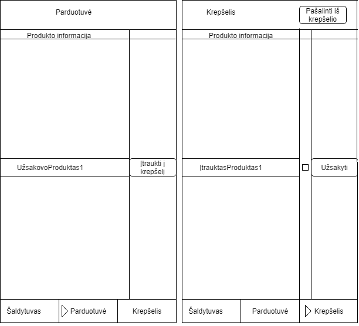

1. [Reikalavimai](#1-reikalavimai) 
	1. [Užsakovo poreikiai](#11-užsakovo-poreikiai) 
	2. [Vartotojiški pasakojimai](#12-vartotojiški-pasakojimai)
	3. [Interfeiso reikalavimai](#13-interfeiso-reikalavimai)
	
	<!-- pagebreak -->

# 1. Reikalavimai

## 1.1 Užsakovo poreikiai

 1. Pritaikyti programą mobiliesiems telefonams.
 2. Pranešti dėl atitinkamų produktų galiojimo laiko pabaigos.
 3. Galimybė užsakyti prekes per mobiliąją programą.
 4. Galimybė dalintis šaldytuvo turiniu su kitais naudotojais(grupė).
 5. Pranešimai, komentarai tarp šeimos narių dėl produktų, receptų.
 6. Kalendoriaus integracija į programą, žymint pirktus produktus pagal dienas.
 7. Numatyti galimybę atvaizduoti maisto tiekėjo pateikiamas reklamas.
 8. Aktyviai teikiama pagalba naudotojui programos naudojimo klausimais.
 9. Automatinis programos klaidų perdavimas kokybės užtikrinimo specialistams.
 10. Trumpas programos aprašas/paaiškinimas pirmą kartą ja įsijungus.

## 1.2 Vartotojiški pasakojimai
   
| Pranešimas dėl galiojimo laiko pabaigos |
|:-----------------------------------:|
| Iki produkto galiojimo pabaigos likus 3 dienoms (jei jo galiojimo laikas nuo įdėjimo į šaldytuvą yra ne mažiau 5d.) ir likus 1 dienai (visada) turi būti gautas pranešimas, įspėjantis apie galiojimo laiko pabaigą ir likusį galiojimo laiką.   Jei kelių produktų galiojimo laikas sutampa, apie juos turi būti pranešama vienu bendru pranešimu. |
   
| Prekės užsakymas per mobiliojo programą |
|:-------------------------------------------------------------:|
| Mobiliojo programoje naudotojas gali ieškoti, kokius produktus parduoda tiekėjai. Turi būti langas, kuriame galima peržiūrėti prekes, jas užsakyti arba įtraukti į krepšelį. Turi būti galimybė atskirame lange redaguoti krepšelio turinį ir užsakyti arba atšaukti.|
   

| Dalijimasis savo šaldytuvo turiniu su kitais naudotojais |
|:-------------------------------------------------------------:|
| Naudotojas, jei nori dalintis savo šaldytuvo turiniu, turi sukurti grupę. Į ją gali kviesti kitus naudotojus. Naudotojai gali atmesti arba priimti kvietimą. Sukurtoje grupėje turi būti galimybė dalintis ir receptais.|
   
| Šaldytuvo informacijos peržiūrėjimas |
|:-------------------------------------------------------------:|
| Turi būti galimybė matyti šaldytuvo turinį, ieškoti receptų ir pažymėti kokius receptus gaminsi. Reikalinga paieška, kad būtų galima patogiai surasti norimą produktą ar panašius produktus.|
   
| Bendravimas apie receptus |
|:-------------------------------------------------------------:|
| Turi būti galimybė pranešti grupės nariams apie naujo recepto sukūrimą arba kokią kitą naujieną (pvz., šaldytuvas sugedo). Nariai atsakydami rašo komentarus, matomus taip pat visiems.|
   
| Produktų komentavimas |
|:-------------------------------------------------------------:|
| Turi būti galimybė grupės nariui rašyti apie konkretų produktą. Naudotojas turi galėti redaguoti ir ištrinti savo komentarus. |
   
| Pranešimų peržiūrėjimas |
|:-------------------------------------------------------------:|
| Pranešimai ir su jais susiję komentarai matomi peržiūrint produkto ar recepto informaciją. |
   
| Naudotojas atsiverčia kalendorių pirkiniams peržiūrėti |
|:-------------------------------------------------------------:|
| Naudotojas gali atsidaryti kalendorių, kuriame mato visus pirktus produktus. Atlikus užsakymą automatiškai išsaugoma, kas ir kada buvo užsakyta, ir tai atvaizduojama. Naudotojas gali pasirinkti konkrečią dieną ir matyti detalią užsakymų informaciją. Taip pat galima pažiūrėti kalendoriuje produktus pagal pristatymo datą ir galiojimo pabaigą. |
   
| Reklamų talpinimas |
|:-------------------------------------------------------------:|
| Turi būti galimybė nustatyti naują reklamą ar pridėti ją į rodomų reklamų rinkinį. Turi būti pasirinkimas patalpinti konkretaus produkto reklamą, kuri būtų matoma tarp naudotojo turimų produktų ar galimų pirkinių, arba reklaminį skelbimą, kuris būtų šalia naudotojui aktualios informacijos.|

| Reklamų peržiūrėjimas |
|:-------------------------------------------------------------:|
| Turi būti galimybė paspausti ant sudominusios reklamos ir naršyklėje pamatyti jos turinį, nebent reklamuojamą produktą galima įsigyti naudojantis programa. Taip pat turi būti galimybė uždaryti nemėgstamas reklamas ir pranešti apie netinkamo turinio reklamas. |

   
| Pagalba naudotojantis sistema |
|:-------------------------------------------------------------:|
| Prieš vedant informaciją į lauką ar spaudžiant mygtuką turi būti galimybė gauti informaciją apie tą mygtuką ar lauką. Informacija turi būti glausta ir suprantama. |
   
| Pranešimas dėl klaidų |
|:-------------------------------------------------------------:|
| Kai programoje įvyksta klaida, kuri sustabdo ar nutraukia veikimą, būna automatiškai pranešama specialistams. Turi būti galimybė pranešti apie klaidą, jei nesutampa gautų produktų informacija. |
   
| Naudotojas susipažįsta su sistema |
|:-------------------------------------------------------------:|
| Per pirmą prisijungimą naudotojas turi būti supažindinamas su pagrindiniu sistemos naudojimu, pateikiant galimų veiksmų sąrašą. Naudotojui taip pat pateikiami galimi sistemos nustatymai, jis su šiais supažindinamas, ir leidžiama jam keisti nustatymus. Naudotojas gali nustatyti, kad šis paaiškinimas kitais kartais nebebus rodomas. |

## 1.3 Interfeiso reikalavimai

### 1.3.1 Grafinės sąsajos eskizai

<!-- pagebreak -->
#### 1.3.1.1 Langas "Senstantys produktai"

Paveikslėlyje 1.3.1.1 pavaizduotas produktų peržiūros langas, kuriame išryškinti senstantys produktai. Lango apačioje yra siūlomi receptai, kurių sudėtyje yra pažymėti senstantys produktai.

Šaldytuvo lange numatoma vaizduoti visus vartotojo šaldytuve esančius produktus, galimybė juos papildyti (pereinama prie užsakymo) ir mygtukas pereiti prie senstančių produktų lango (Žr. 1.3.1.3).

<!-- pagebreak -->
#### 1.3.1.2 Langas "Produktų užsakymas"

Figūroje 1.3.1.2 pavaizduoti parduotuvės ir krepšelio grafinės sąsajos eskizai. Abiejuose languose yra duota galimybė pereiti į kitus sistemos langus (sąsajos apačioje).

Parduotuvės lange yra numatoma rodyti produktą, jo aprašymą ir mygtuką pridėti produktą į krepšelį.

Krepšelio lange yra numatoma rodyti visus vartotojo į krepšelį pridėtus produktus, galimybė juos žymėti ir pažymėtus produktus arba šalinti iš krepšelio, arba juos užsakyti.

<!-- pagebreak -->
#### 1.3.1.3 Langai "Šaldytuvas" ir "Dalintis"

Figūroje 1.3.1.3 pavaizduota numatoma šaldytuvo dalinimosi grafinė sąsaja (bei numatomas būdas į ją pereiti iš šaldytuvo lango). Šiame lange yra rodomi kitų vartotojų vardai ir galimybė tuos vartotojus pažymėt, kad su jais tęsti dalinimąsi.

<!-- pagebreak -->
#### 1.1.3.4 Langas "Bendravimas grupėje"
  

Figūroje 1.3.1.4 pavaizduotos numatomos grafinės sąsajos pokalbiai bei receptų dalinimasis. Pokalbių lange figūruoja pokalbio gija, kurioje rodomi visi iki šiol toje grupėje su vartotoju pasidalinti receptai, tos grupės nariai, kuriuos galima pasirinkti, bei patvirtinimo mygtukas dalintis receptais, kuris nukreipia į receptų dalinimosi langą, kuriame galima pasirinkti receptus, kuriais norima dalintis.

<!-- pagebreak -->
#### 1.1.3.5 Langas "Kalendorius" ir "Dienos užsakymai"
  

Figūroje 1.3.1.5 pavaizduoti kalendoriaus ir dienos aprašymo langai. Iš kalendoriaus patenkama į dienos langą paspaudžiant "+" mygtuką prie dienos. Kiekviena mėnesio diena, kurios metu buvo gautas užsakymas, turi aktyvų "+" mygtuką. Dienos lange yra pavaizduoti užsakymai ir jais gauti produktai: pavadinimai, kiekiai, kainos. Ties kiekvienu produktu galima pasirinkti užsakyti daugiau to produkto. Kalendoriaus lango viršuje yra mygtukai, leidžiantys žiūrėti produktus pagal pasirinktą metriką: užsakymo datą arba galiojimo laiką. Dienos lange leidžiama ieškoti receptų su dienos produktais, kas yra itin svarbu, jei tie produktai artimiausiu metu baigs galioti.

<!-- pagebreak -->
#### 1.3.1.6 Reklamų vaizdavimas produktų peržiūros metu

Figūroje 1.3.1.6 yra pavaizduota numatoma grafinės sąsajos dalis kuri yra skirta būti bent kuriame produktus rodančiame lange. Naršant produktus, kaip pavaizduota, kartais yra įterpiama reklama, kuri nuo kitų produktų skiriasi savo kraštinės spalva (produktai apibrėžti juodai, o reklama mėlynai), bei tuo, kad kampe turi "x" mygtuką.

### 1.3.2 Vartotojo ir sistemos sąveika vykdant užduotis

<!-- pagebreak -->
#### 1.3.2.1 Pranešimo dėl produktų galiojimo pabaigos peržiūrėjimas

Sekų diagramoje 1.3.2.1 parodomi žingsniai, kuriuos sistema vykdo sąveikaudama su vartotoju vykdant pagrindinį ir/ar alternatyvius scenarijus, kai sistemoje yra senstančių produktų. 

<!-- pagebreak -->
#### 1.3.2.2 Produktų užsakymas

Sekų diagramoje 1.3.2.2 parodomi žingsniai, kuriuos sistema vykdo sąveikaudama su vartotoju vykdant pagrindinį ir/ar alternatyvius scenarijus, kai vartotojas nori užsisakyti produktus parduotuvės lange.

<!-- pagebreak -->
#### 1.3.2.3 Šaldytuvo dalinimasis

Sekų diagramoje 1.3.2.3 parodomi žingsniai, kuriuos sistema vykdo sąveikaudama su vartotoju vykdant pagrindinį ir/ar alternatyvius scenarijus, kai vartotojas nori su kitais vartotojais dalintis savo šaldytuvo turiniu.

<!-- pagebreak -->
#### 1.3.2.4 Bendravimas tarp grupės narių

Sekų diagramoje 1.3.2.4 parodomi žingsniai, kuriuos sistema vykdo sąveikaudama su vartotoju vykdant pagrindinį ir/ar alternatyvius scenarijus, kai vartotojas nori su kitais vartotojais grupėje dalintis savo receptais.

<!-- pagebreak -->
#### 1.3.2.5 Produktų peržiūra kalendoriuje
   

Figūroje 1.3.2.5 yra pavaizduota diagrama, nurodanti naudotojo bendravimo su sistema veiksmų seką. Sistema, reaguodama į naudotojo paspaudimus atidaro tam tikrus langus ir atlieka tam tikras operacijas. Naudotojas pirma sąveikauja su kalendoriaus langu, tada paspaudęs ant "+" ties mėnesio diena - su dienos produktų langu. Produktų lange paspaudęs "grįžti" yra grąžinamas į kalendoriaus langą. 

<!-- pagebreak -->
#### 1.3.2.6 Naudotojo sąveika su reklamomis
 

Sekų diagramoje 1.3.2.6 parodomi žingsniai, kuriuos sistema vykdo sąveikaudama su vartotoju vykdant pagrindinį ir/ar alternatyvius scenarijus, kai vartotojas sąveikauja (arba ne) su reklama - arba teigiamai (paspausdamas ją), arba neigiamai ("x" mygtuku ją panaikindamas, arba pranešdamas apie netinkamą turinį).